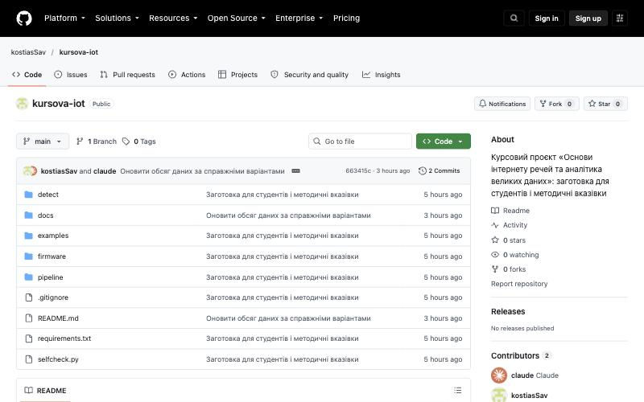
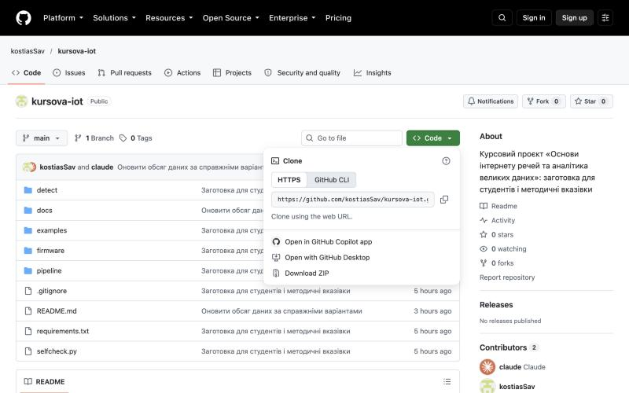

# Крок 0. Підготовка комп'ютера

**Мета:** встановити Python, отримати заготовку проєкту і свої дані, переконатися,
що все запускається. Займе близько двох годин, більшість із яких — очікування
завантажень.

[← До змісту](README.md)

---

## 0.1. Термінал за п'ять хвилин

Майже всі дії в проєкті виконуються командами в **терміналі** — вікні, куди
вводять текстові команди. Боятися його не треба: ви просто копіюєте команду з
посібника, вставляєте у вікно і натискаєте Enter.

Як відкрити термінал:

- **Windows:** натисніть клавішу Windows, наберіть `PowerShell` і відкрийте
  «Windows PowerShell».
- **macOS:** натисніть Cmd+Пробіл, наберіть `Terminal` і натисніть Enter.
- **Linux:** Ctrl+Alt+T.

Чотири команди, яких достатньо на весь проєкт:

| Команда | Що робить |
|---|---|
| `cd назва` | перейти в папку |
| `cd ..` | піднятися на рівень вище |
| `ls` | показати вміст поточної папки (працює і в PowerShell) |
| `pwd` | показати, в якій папці ви зараз |

**Порада.** Якщо поставите редактор VS Code (див. 0.3), відкривайте термінал
прямо в ньому: меню **Terminal → New Terminal**. Він одразу відкриється в папці
проєкту, і `cd` майже не знадобиться.

**Увага.** У посібнику команди наведено **без** запрошення `$` чи `PS C:\>`
на початку. Копіюйте лише саму команду.

---

## 0.2. Встановлення Python

Підходить Python **3.12, 3.13 або 3.14**; рекомендуємо **3.14** — на ній
перевірено весь посібник. Виняток — Mac з процесором Intel: там потрібна
**3.13** (див. нижче).

**Увага.** Не встановлюйте Python **3.15**, навіть якщо сайт пропонує саме
її: для неї ще немає готових збірок кількох бібліотек курсу (pyarrow,
duckdb), і встановлення пакетів на кроці 0.5 завершиться помилкою.

Якщо Python потрібної версії у вас уже є, перейдіть одразу до перевірки
наприкінці цього кроку.

### Windows

1. Відкрийте <https://www.python.org/downloads/windows/>. У розділі
   **Stable Releases** знайдіть найвищий номер **Python 3.14.x** (на момент
   написання — 3.14.8) і натисніть під ним
   **Download Windows installer (64-bit)**. Ця сама версія працює і на
   ноутбуках з ARM-процесором (Snapdragon): Windows запускає її сама, а
   збірки всіх бібліотек курсу є саме для неї.
2. Запустіть завантажений файл. **На першому екрані обов'язково поставте
   позначку «Add python.exe to PATH»**, потім натисніть **Install Now**.
3. Закрийте і знову відкрийте PowerShell, щоб він «побачив» Python.

Ілюстрована інструкція від розробників Python:
<https://docs.python.org/3/using/windows.html>.

### macOS

1. З'ясуйте, який у вас процесор: яблучко в лівому верхньому куті екрана →
   **Про цей Mac**. Якщо в рядку
   «Чип» написано Apple M1, M2 чи новіший — вам потрібна версія **3.14**.
   Якщо в рядку «Процесор» є слово **Intel** — версія **3.13**: для 3.14 на
   Mac з Intel немає готової збірки бібліотеки, без якої не працює метод
   Matrix Profile.
2. Відкрийте <https://www.python.org/downloads/macos/>, знайдіть найвищий
   номер потрібної версії (наприклад, **Python 3.14.8** або **Python
   3.13.16**) і натисніть під ним **Download macOS installer**.
3. Запустіть інсталятор і пройдіть усі кроки з типовими налаштуваннями.
4. Наприкінці відкриється тека з назвою версії, наприклад **Python 3.14**.
   Двічі клацніть у ній **Install Certificates.command**: без цього Python не
   зможе завантажувати файли з інтернету (знадобиться на стадії 4).

Якщо у вас уже є Homebrew, можна й так: `brew install python@3.14` (на Mac з
Intel — `brew install python@3.13`). Тоді на кроці 0.5 створюйте середовище
командою з номером версії: `python3.14 -m venv .venv` (або `python3.13`).

### Linux (Ubuntu, Debian, Mint)

```bash
sudo apt update
sudo apt install python3 python3-venv python3-pip
python3 --version
```

Ubuntu 24.04 і новіші, Debian 13 та Mint 22 ставлять придатну версію.
Якщо `python3 --version` показує 3.11 або меншу (Ubuntu 22.04, Debian 12,
Mint 21), встановіть новішу з репозиторію deadsnakes (лише Ubuntu і Mint):

```bash
sudo add-apt-repository ppa:deadsnakes/ppa
sudo apt install python3.12 python3.12-venv
```

і далі в посібнику пишіть `python3.12` замість `python3` (лише на кроці
0.5, де створюється віртуальне середовище).

На Debian 12 та інших системах, де потрібної версії немає в репозиторіях,
Python найпростіше поставити інструментом **uv**:

```bash
curl -LsSf https://astral.sh/uv/install.sh | sh
```

Відкрийте новий термінал і виконайте:

```bash
uv python install 3.14
```

Тоді на кроці 0.5 замість `python3 -m venv .venv` виконайте
`uv venv --seed --python 3.14 .venv`, решта — без змін.

### Перевірка

**Windows:**

```powershell
python --version
```

**macOS і Linux:**

```bash
python3 --version
```

Маєте побачити номер версії, наприклад:

```
Python 3.14.8
```

**Увага.** Надалі в посібнику на Windows пишіть `python`, а на macOS і Linux —
`python3` там, де команда запускає Python **поза** віртуальним середовищем
(це лише крок 0.5). Усередині віртуального середовища на всіх системах
працює просто `python`.

---

## 0.3. Редактор коду (рекомендовано)

Код можна редагувати будь-де, але найзручніше — у безкоштовному
**Visual Studio Code**: <https://code.visualstudio.com/>.

Після встановлення відкрийте вкладку **Extensions** (Ctrl+Shift+X, на macOS
Cmd+Shift+X), знайдіть **Python** від Microsoft і натисніть **Install**.

Коли отримаєте заготовку (крок 0.4), відкрийте її папку у VS Code:
**File → Open Folder…** і виберіть `kursova-iot`. Відтепер **Terminal → New
Terminal** відкриває термінал одразу в папці проєкту.

---

## 0.4. Отримання заготовки проєкту

Заготовка лежить у відкритому репозиторії
<https://github.com/kostiasSav/kursova-iot>.



### Варіант А — без Git (найпростіше)

1. Відкрийте сторінку репозиторію.
2. Натисніть зелену кнопку **Code** і виберіть **Download ZIP**.
3. Розпакуйте архів (Windows: правою кнопкою → **Видобути все…**; macOS:
   подвійний клік). Вийде папка `kursova-iot-main`. Перейменуйте її на
   `kursova-iot` і перенесіть у **просту папку без кирилиці й пробілів у
   шляху**:
   - Windows — у корінь диска C:, щоб шлях був `C:\kursova-iot` (не в
     «Документи» чи на Робочий стіл: кирилиця в шляху і синхронізація
     OneDrive заважають Docker);
   - macOS і Linux — у домашню папку, щоб шлях був `~/kursova-iot`.

   Windows іноді створює папку в папці: `kursova-iot-main\kursova-iot-main`.
   Переносьте **внутрішню** — ту, у якій лежить `selfcheck.py`.



### Варіант Б — через Git

Якщо ви вже користуєтеся Git (<https://git-scm.com/downloads>):

```bash
git clone https://github.com/kostiasSav/kursova-iot.git
```

Клонуйте в ту саму просту папку: на Windows спершу `cd C:\`, на macOS і
Linux — у домашній папці.

Свою роботу зберігайте у **приватному** репозиторії на GitHub (створіть
новий, а не Fork: форк відкритого репозиторію не може бути приватним) і
дайте доступ керівнику — репозиторій з кодом здається разом із запискою.
Не публікуйте свої дані й результати (`findings.json`, `my_findings.csv`):
передавати їх іншим студентам заборонено (п. 9 вказівок).

### Що має вийти

Новий термінал відкривається в домашній папці. Перейдіть у папку проєкту
і перегляньте її вміст.

**Windows (PowerShell):**

```powershell
cd C:\kursova-iot
ls
```

**macOS і Linux:**

```bash
cd ~/kursova-iot
ls
```

```
README.md
broker
dashboard
detect
docs
examples
firmware
make_findings.py
node
pipeline
processing
realdata
requirements.txt
run_all.py
selfcheck.py
```

(PowerShell показує те саме таблицею, з датами й розмірами.)

**Перевірка.** Ви бачите `selfcheck.py` і `requirements.txt` — отже, ви в
правильній папці. Усі подальші команди виконуються **з цієї папки**.

---

## 0.5. Віртуальне середовище і бібліотеки

Віртуальне середовище — це окрема «коробка» з бібліотеками для цього проєкту,
щоб вони не змішувалися з іншими програмами на вашому комп'ютері.

### Створення (один раз)

**Windows:**

```powershell
python -m venv .venv
```

**macOS і Linux:**

```bash
python3 -m venv .venv
```

### Активація (щоразу, коли відкриваєте новий термінал)

**Windows (PowerShell):**

```powershell
.\.venv\Scripts\Activate.ps1
```

**macOS і Linux:**

```bash
source .venv/bin/activate
```

Після активації на початку рядка терміналу з'явиться `(.venv)`.

**Увага (Windows).** Якщо PowerShell відповідає червоним текстом «running
scripts is disabled on this system», виконайте один раз:

```powershell
Set-ExecutionPolicy -Scope CurrentUser RemoteSigned
```

підтвердіть літерою `Y` і повторіть активацію.

### Встановлення бібліотек

```bash
pip install -r requirements.txt
```

Займає від пів хвилини до кількох хвилин. Наприкінці не має бути червоних
рядків з `ERROR`. Перевірити, що все встановилося:

```bash
pip list
```

У списку мають бути, серед інших, `cbor2`, `cryptography`, `duckdb`,
`matplotlib`, `numpy`, `pandas`, `paho-mqtt`, `psutil`, `pyarrow`, `scipy`.

**Увага.** Бібліотеки для **вашого** сховища, інструмента обробки, детектора
і дашборда в
`requirements.txt` закоментовані — ви встановите лише ті, що вам призначено,
на відповідних стадіях.

---

## 0.6. Ваші дані

Керівник надсилає кожному номер варіанта і посилання на п'ять файлів:

| Файл | Що це |
|---|---|
| `variant_NNN.parquet` | **ваш** набір телеметрії, 4,1–7,3 млн записів |
| `variant_NNN.json` | маніфест: перелік пристроїв і **призначений вам стек** |
| `tuning.parquet` | навчальний набір, однаковий для всіх |
| `tuning.json` | маніфест навчального набору |
| `tuning_truth.json` | відповіді до навчального набору |

Завантажте всі п'ять файлів **у папку проєкту** — поруч із `selfcheck.py`.
Найпростіше — просто відкрити кожне посилання в браузері і перенести файл із
«Завантажень». Або командою (замініть посилання на свої):

**Windows (PowerShell):**

```powershell
curl.exe -LO https://github.com/kostiasSav/kursova-iot/releases/download/v1/tuning.parquet
```

**macOS і Linux:**

```bash
curl -LO https://github.com/kostiasSav/kursova-iot/releases/download/v1/tuning.parquet
```

**Увага.** Файли `.parquet` не відкриваються в Excel чи в «Блокноті» — це
нормально. Вони призначені для програм, а не для перегляду очима.

### Ваш призначений стек

Відкрийте `variant_NNN.json` у VS Code і знайдіть блок `assigned_stack`
(Ctrl+F, на macOS Cmd+F). Наприклад, для навчального набору він такий:

```json
"assigned_stack": {
  "storage": "InfluxDB",
  "processing": "DuckDB SQL",
  "detector": "Matrix Profile",
  "dashboard": "Streamlit"
}
```

Випишіть свої чотири значення — вони визначають, які розділи посібника
стосуються саме вас:

| Поле | Де знадобиться |
|---|---|
| `storage` — сховище | стадія 2 |
| `processing` — інструмент обробки | стадія 2 |
| `detector` — призначений детектор | стадія 3 |
| `dashboard` — інструмент візуалізації | стадія 6 |

---

## 0.7. Перша перевірка

Переконаймося, що все працює, на навчальному наборі. Віртуальне середовище
має бути активоване (`(.venv)` на початку рядка).

```bash
python selfcheck.py --findings examples/findings.example.json --data tuning.parquet --manifest tuning.json
```

Маєте побачити:

```
Картка результатів, перерахована з ваших даних:
  Кількість записів          : 1 157 147
  Пристроїв у маніфесті      : 51
  Пристроїв у даних          : 52
  SHA-256 переліку пристроїв : 1a33058d845b45c2ce0ddff78318cad7cab1f1b8c9a25aed2e3cdbafc84b7098
  (розбіжність на 1 — це не помилка генерації)
  Призначений стек           : storage=InfluxDB, processing=DuckDB SQL, detector=Matrix Profile, dashboard=Streamlit

Знахідок у файлі: 3

Файл придатний до перевірки.
Це не означає, що знахідки правильні — лише що формат коректний.
```

Тепер те саме для **вашого** варіанта — так ви отримаєте свою картку
результатів:

```bash
python selfcheck.py --findings examples/findings.example.json --data variant_NNN.parquet --manifest variant_NNN.json
```

Цього разу внизу будуть повідомлення `ПОМИЛКА` про номер варіанта і картку —
це очікувано: файл-приклад складено для навчального набору. Важлива верхня
частина: **це ваша картка результатів.**

**У звіт.** Збережіть ці числа: картка розміщується одразу після титульного
аркуша пояснювальної записки (п. 6.1 вказівок).

### Приклад детектора

```bash
python detect/example.py
```

```
завантажено записів: 1 157 147; пристроїв: 52

детектор stuck_at: кандидатів — 1
детектор spike_storm: кандидатів — 1

Якість на навчальному наборі (лише реалізовані класи):
  знайдено 2, хибних 0, пропущено 0
  точність 1.00   повнота 1.00   F1 1.00

Усі 12 класів:
  знайдено 2, хибних 0, пропущено 10
  точність 1.00   повнота 0.17   F1 0.29
    ПРОПУЩЕНО  INC-01 rogue_device 2025-09-01T21:09 door-05-mee
    …
```

Приклад знаходить два класи інцидентів із дванадцяти. Решту ви навчитеся
шукати на стадіях 3 і 5.

---

## Контрольний список кроку 0

- [ ] `python --version` (або `python3 --version`) показує 3.12, 3.13 або 3.14.
- [ ] Папка проєкту містить `selfcheck.py`.
- [ ] Віртуальне середовище створене й активується, `pip list` показує
      бібліотеки.
- [ ] П'ять файлів даних лежать у папці проєкту.
- [ ] `selfcheck.py` друкує вашу картку результатів.
- [ ] Ви виписали свій призначений стек.

[Далі: стадія 1 — вузол IoT →](01-vuzol.md)
