# Стадія 1. Вузол інтернету речей

**Мета:** зібрати в симуляторі Wokwi вузол на ESP32, який надсилає показання
давачів через MQTT, і на власному досвіді переконатися, що без шифрування
телеметрію може прочитати будь-хто. Складник «Вузол IoT, MQTT, захищеність
каналу» — 15 балів; його оцінюють на демонстрації (крок 8.1).

Для вузла потрібні лише браузер і, для збереження проєкту, безкоштовний
акаунт Wokwi.
Залізо не потрібне.

[← До змісту](README.md)

---

## 1.1. Проєкт у Wokwi

1. Відкрийте <https://wokwi.com/projects/new/esp32>. З'явиться редактор з
   вкладками `sketch.ino` і `diagram.json` ліворуч і симулятором праворуч.
2. Щоб зберігати роботу, натисніть **Sign up** і зареєструйтеся (можна через
   Google чи GitHub). Це безкоштовно. Без реєстрації симулятор працює, але
   проєкт зникне, щойно ви закриєте вкладку.
3. Відкрийте у VS Code файл `firmware/sketch.ino` із заготовки, виділіть усе
   (Ctrl+A, на macOS Cmd+A), скопіюйте і вставте у вкладку `sketch.ino` у
   Wokwi замість наявного тексту.
4. Те саме зробіть із `firmware/diagram.json` → вкладка `diagram.json`.
   Праворуч з'являться плата ESP32, давач температури й вологості DHT22 і
   модуль фоторезистора.
5. Створіть файл бібліотек: натисніть стрілку **▾** праворуч від вкладок,
   виберіть **New file…**, назвіть файл `libraries.txt` і вставте вміст
   `firmware/libraries.txt`.
6. Знайдіть на початку `sketch.ino` налаштування і впишіть свій варіант:

```cpp
static const int   VARIANT   = 47;              // <- ваш номер варіанта
static const char *DEVICE_ID = "esp32-047";     // <- esp32-<номер варіанта>
```

7. Натисніть **Save**, потім зелену кнопку ▶ над симулятором.

Перший запуск триває до хвилини: Wokwi компілює прошивку на своєму сервері.
Потім унизу з'явиться монітор послідовного порту:

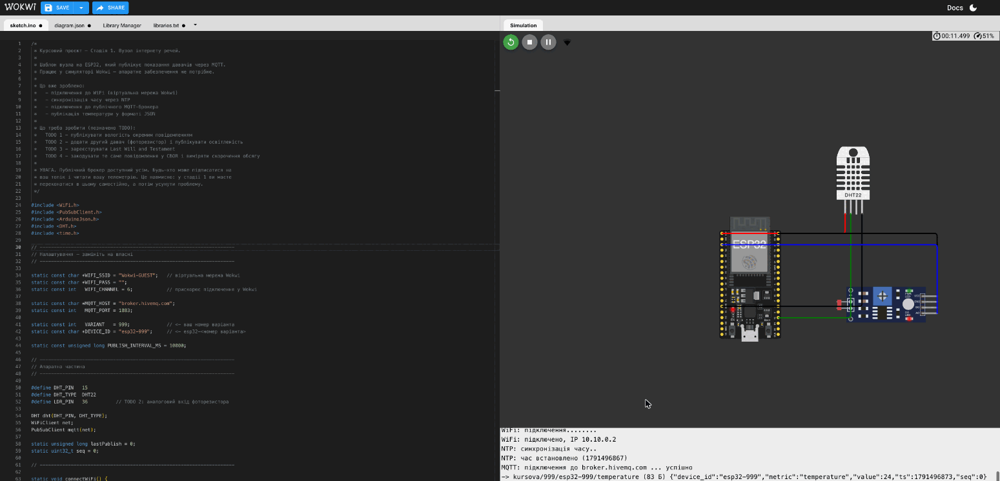

Справжній вивід заготовки (демонстраційний варіант 999; у вас — ваш номер):

```
=== Вузол IoT: курсовий проєкт ===
WiFi: підключення........
WiFi: підключено, IP 10.10.0.2
NTP: синхронізація часу..
NTP: час встановлено (1791496867)
MQTT: підключення до broker.hivemq.com ... успішно
-> kursova/999/esp32-999/temperature (83 Б) {"device_id":"esp32-999","metric":"temperature","value":24,"ts":1791496873,"seq":0}
```

Перед цими рядками ESP32 друкує кілька службових рядків завантажувача
(`ets Jul 29 2019…`, `rst:0x1 (POWERON_RESET)…`) — так і має бути.

**Увага.** Поки працює симуляція, тримайте вкладку Wokwi **на екрані**. У
фоновій вкладці чи під іншим вікном браузер пригальмовує симуляцію (праворуч
угорі видно швидкість, наприклад `3%` замість `100%`), і брокер може
розірвати з'єднання: у моніторі з'являтимуться повторні
`MQTT: підключення…`.

**Перевірка.** Кожні 10 секунд з'являється новий рядок `->`. Якщо бачите `!!`
або MQTT не підключається — розділ [Типові проблеми](09-problemy.md).

---

## 1.2. Чотири завдання в прошивці

У `sketch.ino` позначено чотири місця `TODO`. Нижче — код для кожного і
пояснення, що він робить. Вставляйте його **замість** відповідного коментаря
`TODO`, а потім розберіться в кожному рядку: на захисті про нього спитають.

### TODO 1. Вологість окремим повідомленням

Давач DHT22 уже читає вологість у змінну `h`. Опублікуйте її так само, як
температуру:

```cpp
  publishMetric("humidity", h);
```

### TODO 2. Фоторезистор і освітленість у люксах

Модуль фоторезистора видає напругу, що залежить від освітлення. ESP32 читає її
як число від 0 до 4095 (12 біт), що відповідає 0–3,3 В. Формулу переведення в
люкси взято з документації Wokwi
(<https://docs.wokwi.com/parts/wokwi-photoresistor-sensor>); там вона наведена
для Arduino Uno (5 В, 10 біт), тож ми перерахували її для ESP32:

```cpp
  int raw = constrain(analogRead(LDR_PIN), 1, 4094);  // без ділення на нуль
  float voltage = raw / 4095.0 * 3.3;
  float resistance = 10000.0 * voltage / (3.3 - voltage);
  float lux = pow(50 * 1e3 * pow(10, 0.7) / resistance, 1 / 0.7);
  publishMetric("illuminance", lux);
```

Під час симуляції клацніть на фоторезистор і посуньте повзунок `lux` —
показання в моніторі має змінитися відповідно.

**У звіт.** Поясніть формулу: дільник напруги з резистором 10 кОм, опір
фоторезистора, степенева залежність опору від освітленості (параметри
`GAMMA = 0.7`, `RL10 = 50`).

### TODO 3. Last Will and Testament

«Останній заповіт» — повідомлення, яке **брокер** публікує замість вузла, якщо
вузол зник без попередження (вимкнули живлення, обірвався зв'язок). Його
реєструють під час підключення. Замініть рядки

```cpp
    if (mqtt.connect(clientId.c_str())) {
      Serial.println("успішно");
```

на

```cpp
    String willTopic = topicFor("status");
    if (mqtt.connect(clientId.c_str(), willTopic.c_str(), 1, true,
                     "{\"online\": false}")) {
      Serial.println("успішно");
      mqtt.publish(willTopic.c_str(), "{\"online\": true}", true);
```

Аргументи `connect`: ідентифікатор клієнта, топік заповіту, рівень QoS 1,
прапорець `retain` (брокер зберігає останнє значення для нових підписників) і
текст заповіту. Одразу після підключення вузол сам публікує
`{"online": true}` у той самий топік.

**Перевірка.** Підпишіться на свій топік у браузері (див. 1.3, крок 1) і
зупиніть симуляцію кнопкою ■. У топіку `.../status` має з'явитися
`{"online": false}` — його надіслав брокер, а не вузол.

### TODO 4. CBOR замість JSON — скільки економимо

CBOR (RFC 8949) — двійковий аналог JSON: та сама структура «ключ — значення»,
але без лапок, дужок і текстових чисел. Повідомлення **публікуються й надалі в
JSON** (так вимагає Додаток А); CBOR лише кодується поруч, щоб виміряти
різницю в розмірі.

Бібліотеки CBOR для цього не потрібно — нам вистачить трьох коротких функцій.
Вставте їх **перед** функцією `publishMetric`:

```cpp
// CBOR (RFC 8949): мінімальний кодувальник рівно для нашого повідомлення.
// Заголовок елемента: 3 біти "основного типу" + довжина або значення.
static size_t cborHead(uint8_t *p, uint8_t major, uint32_t v) {
  if (v < 24)    { p[0] = (major << 5) | v;  return 1; }
  if (v < 256)   { p[0] = (major << 5) | 24; p[1] = v; return 2; }
  if (v < 65536) { p[0] = (major << 5) | 25; p[1] = v >> 8; p[2] = v; return 3; }
  p[0] = (major << 5) | 26;
  p[1] = v >> 24; p[2] = v >> 16; p[3] = v >> 8; p[4] = v;
  return 5;
}

static size_t cborText(uint8_t *p, const char *s) {   // основний тип 3: текст
  size_t len = strlen(s);
  size_t k = cborHead(p, 3, len);
  memcpy(p + k, s, len);
  return k + len;
}

static size_t cborFloat(uint8_t *p, float f) {        // 0xFA: float32
  uint32_t bits;
  memcpy(&bits, &f, sizeof bits);
  p[0] = 0xFA;
  p[1] = bits >> 24; p[2] = bits >> 16; p[3] = bits >> 8; p[4] = bits;
  return 5;
}
```

А на місці коментаря `TODO 4` усередині `publishMetric` — кодування і вивід
розмірів:

```cpp
  uint8_t cbor[160];
  size_t m = cborHead(cbor, 5, 5);                     // словник із 5 пар
  m += cborText(cbor + m, "device_id"); m += cborText(cbor + m, DEVICE_ID);
  m += cborText(cbor + m, "metric");    m += cborText(cbor + m, metric);
  m += cborText(cbor + m, "value");     m += cborFloat(cbor + m, value);
  m += cborText(cbor + m, "ts");        m += cborHead(cbor + m, 0, doc["ts"].as<uint32_t>());
  m += cborText(cbor + m, "seq");       m += cborHead(cbor + m, 0, doc["seq"].as<uint32_t>());
  Serial.printf("   CBOR: %u Б замість %u Б (менше на %.0f%%)\n",
                (unsigned)m, (unsigned)n, 100.0 * (n - m) / n);
```

Справжній вивід після всіх чотирьох TODO (демонстраційний варіант 999):

```
MQTT: підключення до broker.hivemq.com ... успішно
-> kursova/999/esp32-999/temperature (83 Б) {"device_id":"esp32-999","metric":"temperature","value":24,"ts":1791496470,"seq":0}
   CBOR: 64 Б замість 83 Б (менше на 23%)
-> kursova/999/esp32-999/humidity (80 Б) {"device_id":"esp32-999","metric":"humidity","value":40,"ts":1791496470,"seq":1}
   CBOR: 61 Б замість 80 Б (менше на 24%)
-> kursova/999/esp32-999/illuminance (89 Б) {"device_id":"esp32-999","metric":"illuminance","value":499.6337,"ts":1791496470,"seq":2}
   CBOR: 64 Б замість 89 Б (менше на 28%)
```

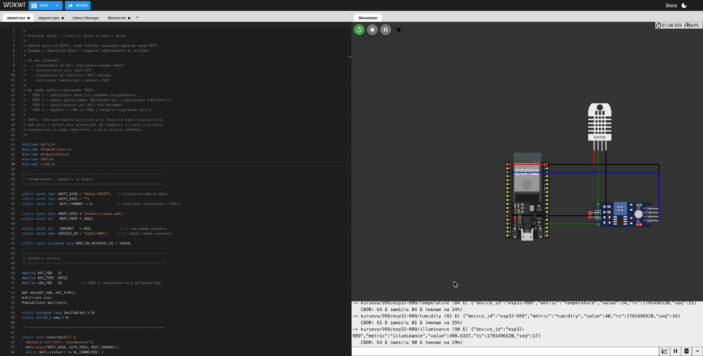

Розміри змінюються на байт-два залежно від числа: `"seq":15` на один
символ довший за `"seq":3`.

**У звіт.** Таблиця «показник — розмір JSON — розмір CBOR — економія, %».
Потім помножте економію на кількість пристроїв вашого варіанта (з маніфесту),
на кількість повідомлень на добу і на 60 діб — скільки трафіку коштує
зручність JSON. Подумайте, чому економія лише близько чверті: більшу частину
повідомлення займають **назви полів**, а їх CBOR не скорочує.

---

## 1.3. Дослідження захищеності каналу

Ваш вузол надсилає дані на **публічний** брокер `broker.hivemq.com` без
шифрування і без пароля. Три кроки покажуть, що це означає. Усі виконуються
на одному комп'ютері.

### Крок 1. Сторонній клієнт у браузері

Будь-хто в інтернеті може підписатися на ваш топік. Перевірмо це веб-клієнтом
MQTT — нічого встановлювати не треба.

1. Залиште симуляцію в Wokwi запущеною і відкрийте в **іншій вкладці**
   <https://www.hivemq.com/demos/websocket-client/>.
2. У полі **Host** впишіть `broker.hivemq.com`, порт залиште `8884`, натисніть
   **Connect**. Індикатор стане зеленим із написом `connected`.

   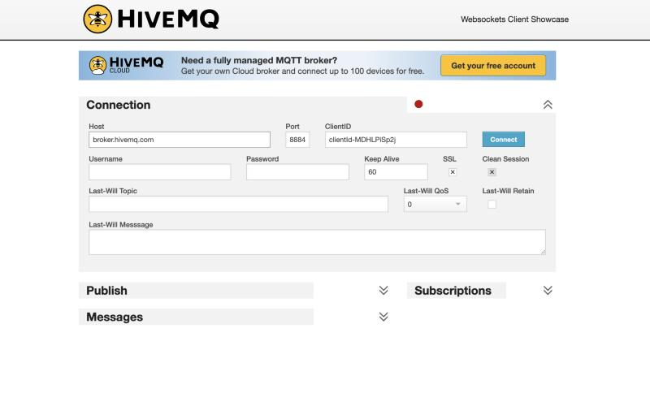

3. Натисніть **Add New Topic Subscription**, у полі **Topic** впишіть
   `kursova/<номер>/#` (ваш номер варіанта без нулів попереду, як у прошивці,
   наприклад `kursova/47/#`) і натисніть **Subscribe**.

   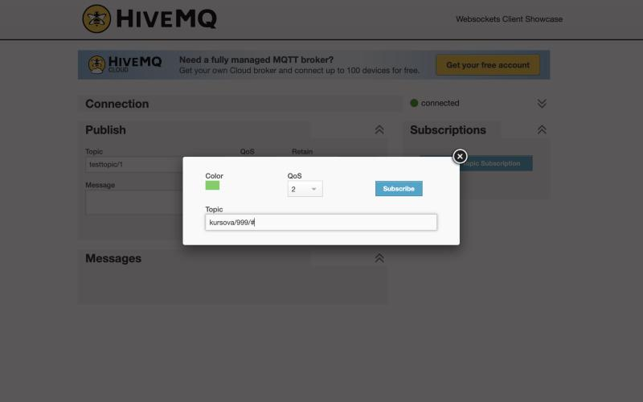

4. За кілька секунд у блоці **Messages** з'являться ваші повідомлення —
   повністю читабельні.

   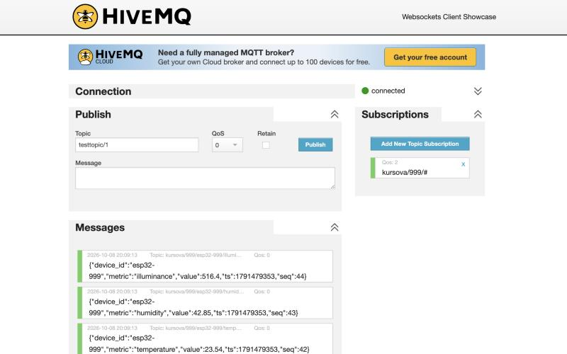

Символ `#` означає «усі підтопіки»: так сторонній бачить усі показники всіх
ваших пристроїв однією підпискою.

**У звіт.** Знімок з повідомленнями і висновок: хто завгодно, знаючи (або
вгадавши) назву топіка, отримує ваші дані в реальному часі.

### Крок 2. Перехоплення трафіку у Wireshark

Підписка — «чесний» спосіб читати чужі дані: брокер сам їх віддає.
Перехоплення — інший: дані дістають безпосередньо з мережевого трафіку, і
брокер про це навіть не дізнається. Wokwi вміє записати весь мережевий трафік
симульованого ESP32 у файл PCAP, який відкривається програмою Wireshark.

**Встановлення Wireshark.** Він знадобиться і в кроці 3 — там уже для запису
трафіку на вашому комп'ютері, — тому встановлюйте одразу з усім потрібним:

- **Windows.** <https://www.wireshark.org/download.html> →
  **Windows x64 Installer** (на ноутбуках з ARM-процесором —
  **Windows Arm64 Installer**). Під час встановлення погодьтеся встановити
  **Npcap**: без нього Wireshark не зможе записувати трафік. Додаткових
  позначок у вікнах Npcap ставити не треба.
- **macOS.** Та сама сторінка → **macOS Universal Disk Image**. Перетягніть
  Wireshark у теку «Програми», потім у тому самому вікні двічі клацніть
  **Install ChmodBPF.pkg** — це дозвіл записувати трафік. Якщо Wireshark
  згодом не показує жодного інтерфейсу, вийдіть із системи й увійдіть знову.
- **Linux.**

  ```bash
  sudo apt install wireshark
  ```

  На запитання «Should non-superusers be able to capture packets?» оберіть
  **Yes**. Потім додайте себе до групи `wireshark` і вийдіть із системи та
  увійдіть знову:

  ```bash
  sudo usermod -a -G wireshark $USER
  ```

**Перехоплення:**

1. Поки симуляція працює хвилину-дві, натисніть у Wokwi значок WiFi —
   праворуч від кнопок керування симуляцією — і виберіть
   **Download PCAP file**. Завантажиться файл `wokwi.pcap`. Кнопку
   **Enable Private Gateway** не натискайте: це платна функція, вона не
   потрібна.

   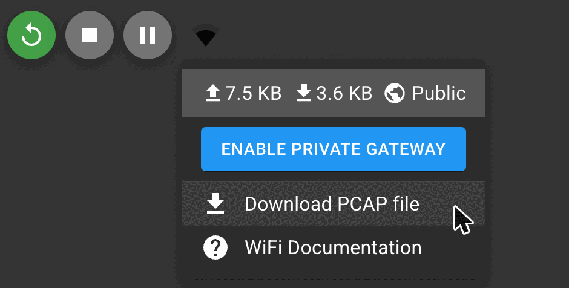

2. Відкрийте його у Wireshark (**File → Open**).
3. У рядку фільтра вгорі (там, де написано *Apply a display filter*) введіть
   `mqtt` і натисніть Enter. Залишаться лише пакети MQTT.
4. Клацніть будь-який рядок `Publish Message`. У нижній лівій панелі
   клацніть трикутник ▸ біля **MQ Telemetry Transport Protocol** — розгорнуться
   поля повідомлення: **Topic** і **Message**.
5. Поле **Message** спершу показано шістнадцятковими цифрами
   (`7b2264657669...`). Щоб побачити текст, клацніть **правою** кнопкою рядок
   **MQ Telemetry Transport Protocol** і виберіть
   **Protocol Preferences → Show Message as text**. Wireshark запам'ятає це
   налаштування.

   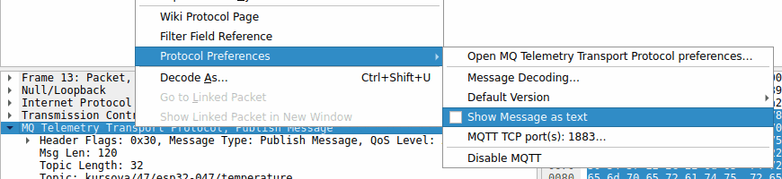

Тепер у полі **Message** — ваш JSON відкритим текстом:

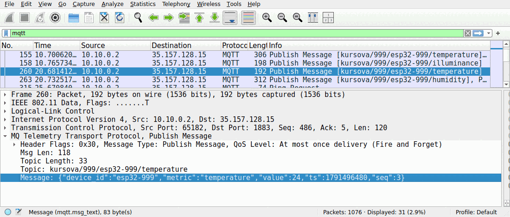

У стовпцях **Source** і **Destination** — адреса симульованого ESP32
(`10.10.0.2`) і адреса брокера, порт `1883`. Крім MQTT, у записі є службові
пакети WiFi, DHCP, DNS і NTP — фільтр `mqtt` їх ховає.

**У звіт.** Знімок вікна Wireshark з розгорнутим повідомленням і висновок:
кожен, хто має доступ до мережі між вузлом і брокером (той самий Wi-Fi,
провайдер, будь-який проміжний вузол мережі), бачить дані, навіть не
підписуючись на топік.

### Крок 3. Власний брокер з TLS і паролем

Тепер зробимо як слід: власний брокер **Mosquitto**, який пускає лише за
паролем і шифрує з'єднання протоколом **TLS**. Безкоштовний Wokwi не бачить
вашого комп'ютера, тому в цьому кроці вузол замінює програма `node/node.py`:
вона надсилає ті самі повідомлення, що й прошивка, — ті самі топіки, той
самий JSON, той самий Last Will. Оцінку це не знижує.

Знадобляться **три вікна терміналу** (у VS Code — три вкладки терміналу,
кнопка **+** у панелі терміналу):

| Вікно | Що в ньому працює |
|---|---|
| **A** | брокер Mosquitto |
| **B** | вузол `node/node.py` |
| **C** | «зловмисник», а потім законний підписник |

Кожне нове вікно спершу переведіть у папку проєкту й активуйте віртуальне
середовище (як у кроці 0.5). На Windows додайте ще один рядок — про нього
нижче, у 3.1.

#### 3.1. Встановлення Mosquitto

**Windows**

1. Відкрийте <https://mosquitto.org/download/> і завантажте інсталятор
   `mosquitto-2.1.2-install-windows-x64.exe` (або новішу версію 2.x).
2. Запустіть його. На екрані **Choose Components** **зніміть позначку
   «Service»**. Інакше інсталятор запустить «системний» брокер, який займе
   порт 1883, і ваш власний брокер не запуститься.
3. Mosquitto встановлюється у `C:\Program Files\Mosquitto`, і PowerShell
   про цю папку не знає. **У кожному новому вікні**, де працюватимете з
   Mosquitto (A і C), спершу виконайте:

   ```powershell
   $env:Path += ";C:\Program Files\Mosquitto"
   ```

**macOS**

Mosquitto для macOS встановлюється через **Homebrew** — безкоштовний
«магазин» програм для терміналу.

1. Перевірте, чи є Homebrew: `brew --version`. Якщо бачите
   `command not found`, відкрийте <https://brew.sh>, скопіюйте команду з
   розділу **Install Homebrew**, вставте її в Термінал і натисніть Enter.
   Він попросить пароль від Mac (символи під час введення не показуються —
   так і має бути) і запропонує встановити Command Line Tools — погодьтеся.
   Триває 5–15 хвилин. Наприкінці Homebrew надрукує розділ **Next steps** з
   командами — виконайте їх по черзі.
2. Встановіть Mosquitto:

   ```bash
   brew install mosquitto
   ```

3. **Не** виконуйте `brew services start mosquitto`: так запуститься
   «системний» брокер, який займе порт 1883.

Якщо згодом на команду `mosquitto` Термінал відповість `command not found`
(буває на Mac з процесором Intel), виконайте один раз і відкрийте Термінал
заново:

```bash
echo 'export PATH="/usr/local/sbin:$PATH"' >> ~/.zprofile
```

**Linux (Ubuntu, Debian, Mint)**

```bash
sudo apt install mosquitto mosquitto-clients
sudo systemctl stop mosquitto
sudo systemctl disable mosquitto
```

Пакет сам запускає «системний» брокер на порту 1883; дві останні команди
зупиняють його і забороняють запускатися разом із системою. Свій брокер ви
запускатимете як звичайний користувач, **без `sudo`**.

**Перевірка (усі системи).**

```bash
mosquitto -h
```

Серед рядків має бути `mosquitto version 2.1.2` (на Linux — `2.0.x`; для
проєкту годиться будь-яка версія 2.x).

#### 3.2. Сертифікати TLS

TLS потребує сертифікатів: брокер показує свій сертифікат, а клієнт перевіряє,
що його підписав відомий клієнтові центр сертифікації (ЦС). Ми створимо
власний маленький ЦС — одна команда (вікно A, папка проєкту, віртуальне
середовище активне):

```bash
python broker/make_certs.py
```

```
Створено у broker/certs:
  ca.crt      сертифікат ЦС — його дають клієнтам (--cafile)
  ca.key      закритий ключ ЦС — секрет
  server.crt  сертифікат брокера для 127.0.0.1, ::1, localhost; дійсний до 2027-10-08
  server.key  закритий ключ брокера — секрет

Далі, з кореня репозиторію:
  1) користувач node і його пароль:  mosquitto_passwd -c broker/passwd node
  2) запуск брокера:                 mosquitto -c broker/mosquitto.conf -v
```

На Windows першим буде ще рядок `0)` — той самий `$env:Path`, що й у 3.1.

`ca.crt` отримують клієнти (вузол і підписник): за ним вони переконуються,
що говорять саме з вашим брокером. `ca.key` і `server.key` — секрети. Файл
`broker/.gitignore` не дає їм потрапити у ваш репозиторій; не обходьте його.

#### 3.3. Користувачі і паролі

Створіть двох користувачів брокера: `node` — для вузла, `reader` — для
законного підписника:

```bash
mosquitto_passwd -c broker/passwd node
mosquitto_passwd broker/passwd reader
```

Кожна команда двічі попросить пароль (символи не показуються). Придумайте
**два різні** паролі й запишіть їх.

**Увага.** Не беріть пароль від жодного свого справжнього акаунта: у досліді
«до» ви побачите його у Wireshark відкритим текстом, а знімок піде у звіт.

**Увага.** Ключ `-c` («create») — **лише для першого користувача**: він
створює файл заново. Mosquitto 2.1 (Windows і macOS) у разі повторного `-c`
відмовиться (`Error: Unable to open file broker/passwd for writing. File exists.`)
— просто повторіть команду без `-c`. Mosquitto 2.0 (Linux) мовчки створить
файл заново, і попередні користувачі зникнуть.

#### 3.4. Запуск брокера (вікно A)

```bash
mosquitto -c broker/mosquitto.conf -v
```

Справжній вивід (перший рядок — з ім'ям вашого користувача — і кілька
однотипних пропущено):

```
17:37:33: mosquitto version 2.1.2 starting
17:37:33: Config loaded from broker/mosquitto.conf.
…
17:37:33: Opening ipv4 listen socket on port 1883.
17:37:33: Opening ipv4 listen socket on port 8883.
17:37:33: mosquitto version 2.1.2 running
```

Брокер слухає два порти: **1883** — без шифрування (лише для порівняння
«до»), **8883** — з TLS. Обидва вимагають пароль і приймають з'єднання лише
з вашого комп'ютера. Чому саме так, пояснюють коментарі у
`broker/mosquitto.conf` — прочитайте їх.

Залиште вікно A відкритим: тут видно кожне підключення й кожну відмову.
Зупинити брокер — Ctrl+C.

**Перевірка.** Останній рядок — `running`. Якщо бачите
`Error: Address already in use` (або подібне на Windows), порт 1883 займає
інший брокер — див. [Типові проблеми](09-problemy.md).

#### 3.5. Запис трафіку у Wireshark

Вузол і брокер працюють на одному комп'ютері, тож їхній трафік іде через
особливий «внутрішній» мережевий інтерфейс — **loopback**.

1. Відкрийте Wireshark. На стартовому екрані в полі
   **…using this filter** введіть фільтр запису:

   ```
   tcp port 1883 or tcp port 8883
   ```

2. У переліку інтерфейсів двічі клацніть loopback:
   - Windows — **Adapter for loopback traffic capture**;
   - macOS — **Loopback: lo0**;
   - Linux — **Loopback: lo**.

   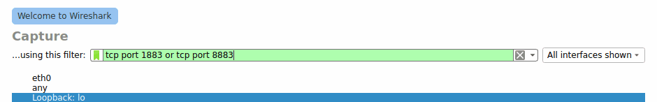

Запис почався. Поки що список порожній — трафіку ще немає.

#### 3.6. «До»: вузол без шифрування (вікно B)

```bash
python node/node.py --variant 47 --username node --count 3 --interval 2
```

(замість `47` — ваш номер варіанта). Вузол попросить пароль користувача
`node`, надішле три цикли вимірювань і завершиться:

```
Вузол esp32-047, варіант 47 -> 127.0.0.1:1883, TLS: ні, користувач: node
Пароль користувача node: 
Підключено до 127.0.0.1:1883. Шифрування: немає.
Last Will зареєстровано: kursova/47/esp32-047/status = {"online": false}
-> kursova/47/esp32-047/status  {"online": true}  (retain)
-> kursova/47/esp32-047/temperature  JSON 86 Б, CBOR 68 Б  {"device_id":"esp32-047","metric":"temperature","value":21.75,"ts":1791482957,"seq":0}
-> kursova/47/esp32-047/humidity  JSON 83 Б, CBOR 65 Б  {"device_id":"esp32-047","metric":"humidity","value":46.38,"ts":1791482957,"seq":1}
-> kursova/47/esp32-047/illuminance  JSON 84 Б, CBOR 68 Б  {"device_id":"esp32-047","metric":"illuminance","value":1.5,"ts":1791482957,"seq":2}
…
Штатне завершення: kursova/47/esp32-047/status = {"online": false}, DISCONNECT надіслано.

Надіслано повідомлень: 9. Середній розмір: JSON 84,3 Б, CBOR 67,0 Б — CBOR коротший на 17,3 Б (20,6 %).
```

`node.py` наприкінці друкує середню економію CBOR (тут 20,6 %). Вона менша,
ніж у прошивці (23–28 %), бо Python записує дробове число у CBOR вісьмома
байтами, а ESP32 — чотирма. У звіт наводьте числа з прошивки (TODO 4), а
різницю можна пояснити саме цим.

У вікні A з'являться рядки на кшталт
`New client connected from 127.0.0.1:… as esp32-047-… (p4, c1, k15, u'node')`.

Тепер у Wireshark введіть фільтр відображення `mqtt` і клацніть рядок
**Connect Command** — перше повідомлення вузла. Розгорніть
**MQ Telemetry Transport Protocol**:

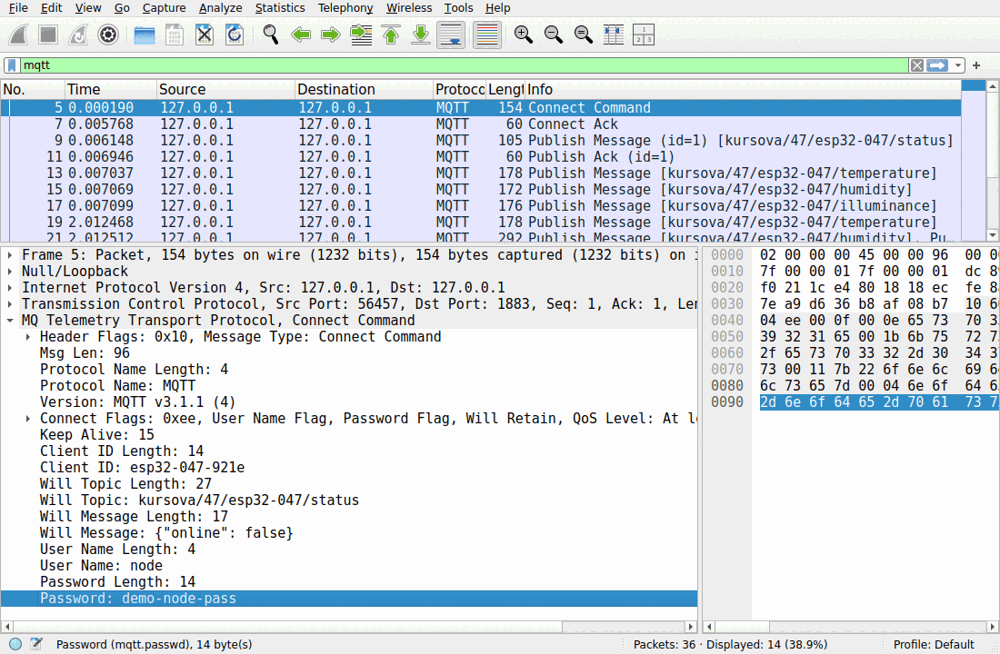

Ім'я користувача **і пароль** видно відкритим текстом — так само, як і
заповіт Last Will. Клацніть далі будь-який **Publish Message**:

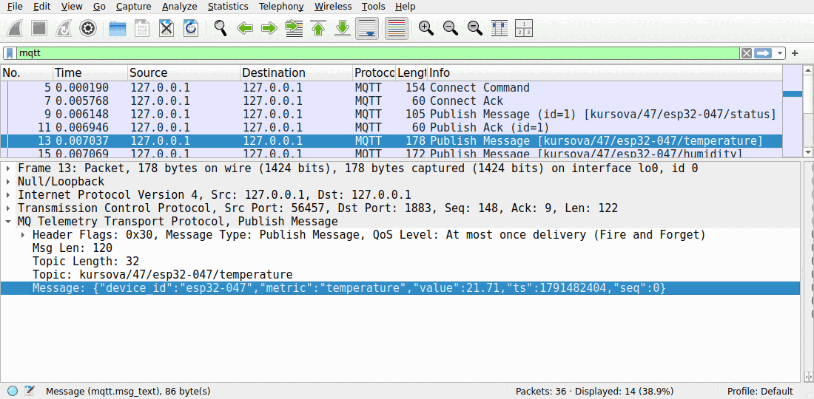

Пароль захищає брокер від чужих **підключень**, але нічого не приховує в
**мережі**: хто записує трафік, той отримує і дані, і сам пароль.

#### 3.7. «Після»: вузол з TLS (вікно B)

Той самий вузол, але через порт 8883 і з перевіркою сертифіката брокера:

```bash
python node/node.py --variant 47 --username node --cafile broker/certs/ca.crt --count 3 --interval 2
```

```
Вузол esp32-047, варіант 47 -> 127.0.0.1:8883, TLS: так, користувач: node
Пароль користувача node: 
Підключено до 127.0.0.1:8883. Шифрування: TLSv1.3, шифр TLS_AES_256_GCM_SHA384.
…
```

Порт 8883 вузол вибрав сам: `--cafile` вмикає TLS. У вікні A тепер є ще
рядок `negotiated TLSv1.3 cipher TLS_AES_256_GCM_SHA384`.

У Wireshark з фільтром `mqtt` нових рядків **немає**: Wireshark не може
навіть розпізнати MQTT. Змініть фільтр на `tls`:

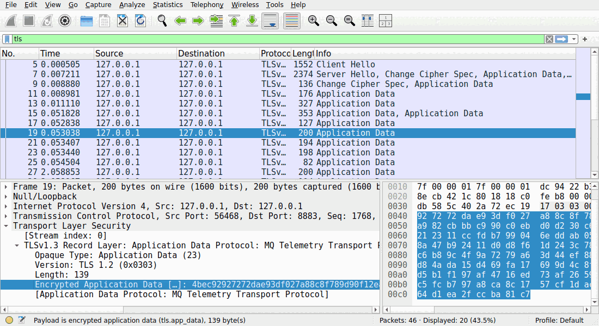

Після «рукостискання» (`Client Hello`, `Server Hello`) іде лише
`Application Data` — зашифровані байти. Підпис *Application Data Protocol:
MQ Telemetry Transport Protocol* — це лише здогадка Wireshark за номером
порту 8883: вмісту він не бачить.

Що TLS **не** приховує: адреси й порти, час кожного повідомлення і його
довжину. Порівняйте довжини `Application Data` (194–200 байтів) з розмірами
JSON — ритм надсилання вузла видно і крізь шифрування.

Зупиніть запис у Wireshark (червоний квадрат ■) і збережіть його
(**File → Save As**) — знімки для звіту можна буде зробити пізніше.

#### 3.8. Спроба перехоплення: підписка без пароля (вікно C)

Спробуйте прочитати дані так, як у кроці 1, — підпискою без пароля, спершу
на порт без шифрування, потім на TLS-порт:

```bash
mosquitto_sub -h 127.0.0.1 -p 1883 -t "kursova/#" -v
```

```bash
mosquitto_sub -h 127.0.0.1 -p 8883 --cafile broker/certs/ca.crt -t "kursova/#" -v
```

Обидві спроби закінчуються однаково:

```
Connection error: Connection Refused: not authorised
```

а у вікні A — `disconnected: not authorised.` Пишіть топік у **подвійних**
лапках, як вище: так команда однаково працює на всіх системах.

Тепер законний підписник — `consumer.py` зі стадії 2 від імені `reader`.
Залиште його працювати і в сусідньому вікні B ще раз запустіть вузол з TLS
(команда з 3.7):

```bash
python pipeline/consumer.py --variant 47 --cafile broker/certs/ca.crt --username reader --minutes 1
```

```
Пароль користувача reader: 
підключено до 127.0.0.1:8883 (TLS)
підписка на kursova/47/+/#
  [status] esp32-047: ОФЛАЙН (збережений брокером статус)
  [status] esp32-047: онлайн
  [status] esp32-047: ОФЛАЙН

завершено 2026-10-08T18:00:53+00:00
  прийнято записів : 9
  нерозібраних     : 0
  подій status     : 3
  файл             : stream.parquet
```

З `--cafile` адреса `127.0.0.1` і порт 8883 підставляються самі. Дев'ять
записів — три цикли по три показники.

#### 3.9. Last Will на власному брокері (за бажанням)

Запустіть у вікні C `consumer.py`, як у 3.8, а у вікні B — вузол з TLS
**без** `--count`. Через кілька повідомлень натисніть у вікні B **Ctrl+C**:
вузол обірве з'єднання без попередження, і в C з'явиться
`[status] esp32-047: ОФЛАЙН` — це брокер опублікував заповіт замість вузла.

**У звіт (підрозділ 2.2).**

- Таблиця трьох кроків: що робив «зловмисник» → що отримав.

  | Спроба | Публічний брокер, без TLS | Власний брокер, порт 1883 | Власний брокер, порт 8883 (TLS) |
  |---|---|---|---|
  | Підписка без пароля | … | … | … |
  | Запис трафіку (Wireshark) | … | … | … |

- Знімки: Connect з паролем (порт 1883), Publish з JSON, `Application Data`
  (порт 8883), відмова `not authorised`.
- Висновки: чому пароль без шифрування не захищає; від чого захищає TLS і що
  залишається видимим (адреси, час, розміри); чим перевірка сертифіката за
  `ca.crt` захищає від підставного брокера.
- Що лишилося незахищеним у вашій схемі: будь-хто з чинним паролем читає всі
  топіки (на захисті спитають, як це обмежити — підказка: `acl_file` у
  документації Mosquitto); порт 1883 без шифрування існує лише для досліду.

---

## 1.4. Що внести у звіт (підрозділ 2.2)

- Схема підключення (знімок симулятора Wokwi).
- Формат повідомлення і приклад з монітора.
- Як працює Last Will і знімок із `{"online": false}`.
- Таблиця JSON проти CBOR і розрахунок трафіку за 60 діб.
- Три кроки дослідження захищеності зі знімками і висновок.

---

## Контрольний список стадії 1

- [ ] Вузол у Wokwi надсилає температуру, вологість і освітленість.
- [ ] Після зупинки симуляції в топіку `status` з'являється `{"online": false}`.
- [ ] Ви виміряли розміри JSON і CBOR.
- [ ] Веб-клієнт у браузері читає ваші повідомлення.
- [ ] У Wireshark видно JSON у записаному трафіку.
- [ ] Власний брокер з TLS не віддає дані без пароля, а у Wireshark видно лише
      зашифрований трафік.

[← Крок 0](00-pidhotovka.md) · [Далі: стадія 2 →](02-konveier.md)
