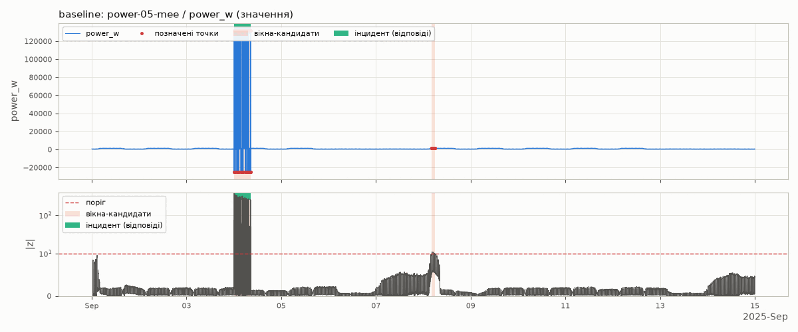
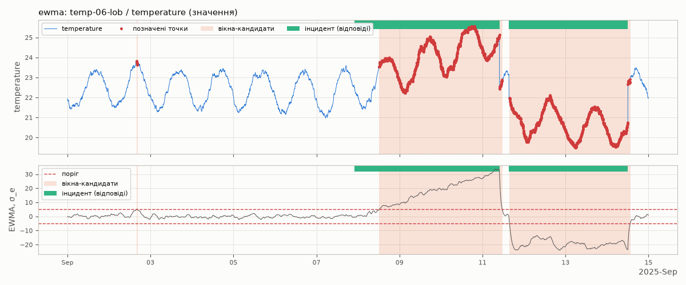
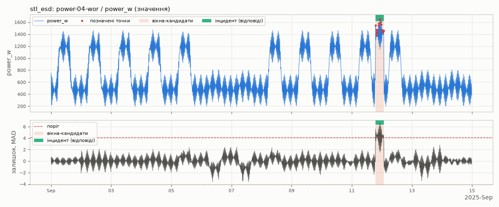
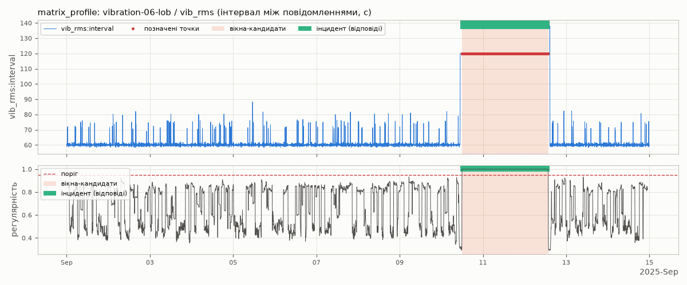
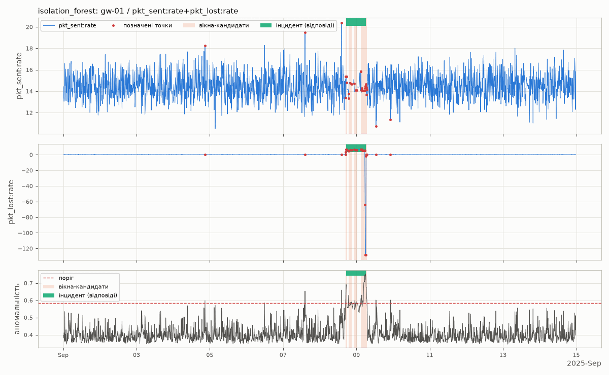
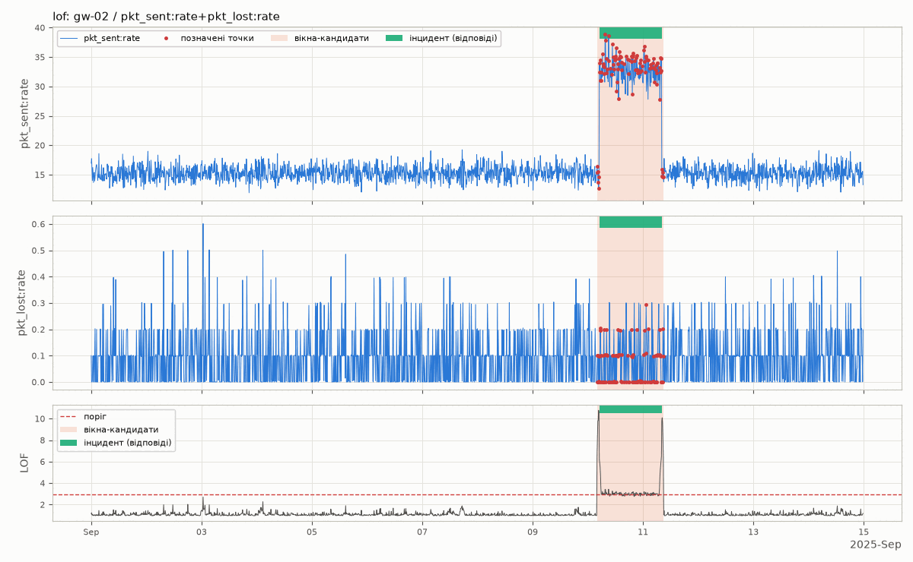

# Стадія 3. Детектори

**Мета:** налаштувати два детектори аномалій — **базовий** статистичний і
**призначений** вам у маніфесті — на навчальному наборі, де відповіді
відомі, і виміряти їхню точність і повноту. Окремих балів стадія не має:
результати йдуть у підрозділи 2.4 і 3.2 записки, а самі детектори — ваші
інструменти на стадіях 4 і 5.

[← До змісту](README.md)

---

## 3.1. Як влаштовані скрипти детекторів

У заготовці є шість готових детекторів:

| Скрипт | Метод | Додаткова бібліотека |
|---|---|---|
| `detect/baseline.py` | базовий: рухома робастна z-оцінка | — |
| `detect/methods/ewma.py` | EWMA control chart | — |
| `detect/methods/stl_esd.py` | STL + ESD | `statsmodels` |
| `detect/methods/matrix_profile.py` | Matrix Profile | `stumpy` |
| `detect/methods/isolation_forest.py` | Isolation Forest | `scikit-learn` |
| `detect/methods/lof.py` | Local Outlier Factor | `scikit-learn` |

Базовий запускають усі. З п'яти інших потрібен лише той, що записаний у вашому
маніфесті (`assigned_stack` → `detector`, див. крок 0).

Усі скрипти працюють однаково:

- аналізують **один ряд** — один показник одного пристрою, який обираєте
  **ви** (`--device`, `--metric`). Вирішувати, які ряди перевіряти, — ваша
  частина роботи;
- друкують таблицю **вікон-кандидатів** — відрізків часу, де детектор щось
  помітив;
- зберігають **графік** (PNG) — на ньому видно, що саме помічено;
- з ключем `--evaluate tuning_truth.json` порівнюють вікна з відповідями
  навчального набору за тими самими правилами, що й автоматична перевірка
  ваших знахідок (розділ 5.2).

Спільні параметри:

| Параметр | Типово | Що означає |
|---|---|---|
| `--data` | `tuning.parquet` | файл з даними |
| `--device` | — | пристрій; без нього скрипт надрукує перелік пристроїв і їхніх показників |
| `--metric` | — | показник; якщо помилитеся в назві, скрипт підкаже правильні |
| `--signal` | `value` | що аналізувати: `value` — самі значення; `rate` — швидкість зростання лічильника (для `pkt_sent`, `pkt_lost`); `interval` — секунди між повідомленнями |
| `--step` | `auto` | крок рівномірної сітки часу (не стосується базового детектора) |
| `--gap` | `1h` | позначки, ближчі за цей проміжок, зливаються в одне вікно |
| `--min-run` | `3` | вікна з меншою кількістю позначок відкидаються як шум |
| `--png` | назва за методом і рядом | куди зберегти графік |
| `--evaluate` | — | файл відповідей, лише `tuning_truth.json` |
| `--json`, `--class` | — | записати вікна як кандидатів у знахідки (див. 3.5) |

Повний перелік з поясненнями: `python detect/baseline.py --help` (так само
для кожного скрипта).

**Увага.** Перший запуск після встановлення бібліотек повільний — до 30–40
секунд: Python будує кеш шрифтів і компілює бібліотеки. Наступні запуски
тривають 1–4 секунди (Matrix Profile — 15–20 секунд щоразу, див. 3.3).

**Як відкрити графік.** Скрипт друкує шлях до PNG у рядку `Графік:`.
Відкрийте файл у VS Code (панель файлів ліворуч) або командою:

- Windows: `Invoke-Item baseline_power-05-mee_power_w.png`
- macOS: `open baseline_power-05-mee_power_w.png`
- Linux: `xdg-open baseline_power-05-mee_power_w.png`

---

## 3.2. Базовий детектор: рухома робастна z-оцінка

**Ідея.** Кожне значення порівнюємо з медіаною значень за попередню добу
(`--window 24h`) і ділимо відхилення на MAD — медіанне абсолютне відхилення
того самого вікна:

```
z = (x − медіана вікна) / (1,4826 · MAD вікна)
```

Точку позначаємо, якщо `|z| > 10` (`--threshold`). Медіана й MAD, на
відміну від середнього і стандартного відхилення, майже не зважають на
викиди: один шалений сплеск не «розмиває» норму для решти точок. Поріг 10
замість класичних 3 — бо реальні дані IoT мають «важкі хвости», і з порогом
3 тривоги лунали б щогодини. Обґрунтування — у коментарях на початку
`detect/baseline.py`; прочитайте їх.

Запуск на пристрої, де навчальний набір містить сплески потужності:

```bash
python detect/baseline.py --device power-05-mee --metric power_w --evaluate tuning_truth.json
```

Справжній вивід:

```
power-05-mee / power_w: 39871 повідомлень, 2025-09-01 – 2025-09-14; сигнал: значення; 39871 точок без сітки

Позначено точок: 147 з 39811. Вікон-кандидатів: 2
   №  початок (UTC)     кінець (UTC)      тривалість  точок  пік оцінки
   1  2025-09-04 00:03  2025-09-04 08:31     8.5 год     73         377
   2  2025-09-08 04:18  2025-09-08 05:48     1.5 год     74        11.1

Графік: …/baseline_power-05-mee_power_w.png

Порівняння з відповідями для power-05-mee: інцидентів за участю пристрою — 1
  ЗНАЙДЕНО   вікно 1   = INC-02 spike_storm        IoU 0.98
  ХИБНЕ      вікно 2   2025-09-08 04:18 - 2025-09-08 05:48  (найбільше перекриття з інцидентом 0.00)
  Точність 0.50 (1 з 2 вікон справжні)   Повнота 1.00 (1 з 1 інцидентів знайдено)
  Нагадування: у findings.json кожне хибне вікно знімає 5 % балів (сумарно до 30 %).
```



Як читати:

- **вікно 1** збіглося з інцидентом `INC-02` (сплески потужності) з
  перекриттям за часом **IoU 0,98** — майже ідеально (зараховується від
  0,25);
- **вікно 2** — хибне: інциденту там немає. На нижній панелі графіка видно,
  що оцінка ледь перевищила поріг (пік 11,1 при порозі 10);
- **точність** — частка справжніх серед знайдених вікон (1 з 2),
  **повнота** — частка знайдених серед справжніх інцидентів (1 з 1).

Що ловить базовий детектор: різкі сплески, серії неможливих значень, перші
години після різкого стрибка рівня. Чого **не** ловить: повільний дрейф
(вікно «пливе» разом із ним) і застигле значення (відхилень немає взагалі).
На двійкових сигналах (двері відчинені/зачинені) він марний: там будь-яка
зміна — «аномалія».

**Спробуйте самі.**

1. Запустіть на «здоровому» пристрої `power-01-mee` — має бути 0 вікон.
2. Лічильники шлюзів (`pkt_sent`, `pkt_lost`) лише зростають, тож їхні
   значення аналізувати безглуздо — аналізуйте їхню швидкість, `--signal rate`
   (для `pkt_sent` скрипт підкаже це сам):

   ```bash
   python detect/baseline.py --device gw-01 --metric pkt_lost --signal rate --evaluate tuning_truth.json
   ```

   З типовим `--gap 1h` один інцидент розпадеться на три шматки: один
   зарахується, два стануть хибними. Повторіть з `--gap 3h` і порівняйте. Це
   важливий урок: **один інцидент, розрізаний на кілька вікон, — це одна
   правильна знахідка і кілька хибних**.
3. Змінюйте `--threshold` (5, 10, 20) і `--window` (6h, 24h, 3D) на кількох
   пристроях і записуйте, як змінюються точність і повнота.

---

## 3.3. Призначений детектор

Встановіть бібліотеку свого методу (у активованому віртуальному
середовищі):

| Метод | Команда |
|---|---|
| EWMA control chart | нічого не треба |
| STL + ESD | `pip install statsmodels` |
| Matrix Profile | `pip install stumpy` |
| Isolation Forest, Local Outlier Factor | `pip install scikit-learn` |

Далі — розділ про **ваш** метод. Інші прочитайте побіжно: на захисті можуть
спитати, чому для певного класу інцидентів ваш метод гірший чи кращий за
інший.

### EWMA control chart

**Ідея.** Окремий відлік шумний, і невеликий, але **сталий** зсув у ньому не
видно. EWMA накопичує відхилення від норми, поступово «забуваючи» старі:
`e_t = λ·r_t + (1 − λ)·e_(t−1)`, де `r_t` — відхилення від типового значення
для цього часу доби. Тривога — коли `e_t` виходить за межі `±L·σ_e`.
Типовий профіль доби рахується за перші 7 діб (`--ref-days`), окремо для
будніх і вихідних: розпорядок будівлі в них різний.

```bash
python detect/methods/ewma.py --device temp-06-lob --metric temperature --evaluate tuning_truth.json
```

```
temp-06-lob / temperature: 19962 повідомлень, 2025-09-01 – 2025-09-14; сигнал: значення; сітка 5min: 4032 точок
Еталонний період: 2025-09-01 00:00 – 2025-09-08 00:00 UTC

Позначено точок: 1700 з 4032. Вікон-кандидатів: 3
   №  початок (UTC)     кінець (UTC)      тривалість  точок  пік оцінки
   1  2025-09-02 16:00  2025-09-02 16:35     0.6 год      7        5.29
   2  2025-09-08 12:10  2025-09-11 11:25    71.2 год    855        33.6
   3  2025-09-11 15:40  2025-09-14 13:30    69.8 год    838         -24
…
  ЗНАЙДЕНО   вікно 2   = INC-04 drift              IoU 0.81
  ЗНАЙДЕНО   вікно 3   = INC-10 sensor_swap        IoU 0.98
  ХИБНЕ      вікно 1   2025-09-02 16:00 - 2025-09-02 16:35  (найбільше перекриття з інцидентом 0.00)
  Точність 0.67 (2 з 3 вікон справжні)   Повнота 1.00 (2 з 2 інцидентів знайдено)
```



Під час дрейфу EWMA повільно повзе вгору за межу +5, а після обміну давачів
різко падає нижче −5: знак піку оцінки показує напрямок зсуву.

Що ловить: повільний дрейф, тривалий зсув рівня (зокрема швидкості
лічильника, `--signal rate`), незвичне споживання. Чого не ловить: поодинокі
короткі сплески — згладжування їх «розмазує».

Параметри: `--lam` (0,1; менше — довша пам'ять), `--L` (5; ширина меж),
`--ref-days` (7; перші дні мають виглядати нормальними — перевірте це на
графіку!), `--profile workdays|day|none`. Спробуйте `--profile day` на
`temp-09-lob` — і побачите, навіщо розділяти будні й вихідні.

### STL + ESD

**Ідея.** STL розкладає ряд на тренд, добову сезонність і залишок; у
залишку узагальнений тест ESD (Rosner, 1983) шукає викиди. Типова сітка —
15 хв: на 5-хвилинній сітці шум перемикань компресора ховає аномалію.

```bash
python detect/methods/stl_esd.py --device power-04-wor --metric power_w --evaluate tuning_truth.json
```

```
power-04-wor / power_w: 39950 повідомлень, 2025-09-01 – 2025-09-14; сигнал: значення; сітка 15min: 1344 точок
STL: період 1D = 96 кроків; ESD знайшов викидів: 16 (шукав не більше 67)

Позначено точок: 16 з 1344. Вікон-кандидатів: 1
   №  початок (UTC)     кінець (UTC)      тривалість  точок  пік оцінки
   1  2025-09-11 19:00  2025-09-12 01:45     6.8 год     16        6.66
…
  ЗНАЙДЕНО   вікно 1   = INC-11 energy_anomaly     IoU 0.99
```



Що ловить: сплески і незвичне для цього часу доби значення. Чого не ловить:
дрейф (STL відносить його до тренду). Слабке місце: період 1 доба не знає
про вихідні — на `temp-09-lob` суботу й неділю буде позначено хибно. Рядок
«ESD знайшов викидів: 67 (шукав не більше 67)» означає, що спрацювала стеля
`--max-share`, — ознака, що метод «стріляє» забагато.

### Matrix Profile

**Ідея.** Для кожного фрагмента ряду довжиною `--window` (2 год) шукаємо
найсхожіший фрагмент деінде. Відстань до цього «двійника» — матричний
профіль. `--find discords` шукає фрагменти, не схожі ні на що (сплеск,
обрив); `--find repeats` — фрагменти, що **надто точно** повторюються
(застигле значення або надто регулярні інтервали між повідомленнями).

```bash
python detect/methods/matrix_profile.py --device vibration-06-lob --metric vib_rms --signal interval --find repeats --evaluate tuning_truth.json
```

```
vibration-06-lob / vib_rms: 18471 повідомлень, 2025-09-01 – 2025-09-14; сигнал: інтервал між повідомленнями, с; сітка 5min: 4032 точок
Рахую матричний профіль: фрагменти завдовжки 2h (точок у кожному: 24)...

Позначено точок: 597 з 4009. Вікон-кандидатів: 1
   №  початок (UTC)     кінець (UTC)      тривалість  точок  пік оцінки
   1  2025-09-10 11:55  2025-09-12 13:40    49.8 год    597           1
…
  ЗНАЙДЕНО   вікно 1   = INC-08 beaconing          IoU 0.96
  Точність 1.00 (1 з 1 вікон справжні)   Повнота 1.00 (1 з 1 інцидентів знайдено)
```



Зазвичай інтервал між повідомленнями — близько 60 с з розкидом, а два дні
поспіль — рівно 120 с: так поводиться не давач, а програма, що «стукає»
назовні за розкладом.

**Увага.** Кожен запуск триває 15–20 секунд (перший — до 40): бібліотека
компілює свій код. Скрипт не завис. На **Mac з процесором Intel** stumpy
встановлюється лише на Python 3.12 або 3.13 (крок 0.2).

Чого не ловить: повільний дрейф і незвичне споживання. Discords на
сигналах «увімкнено/вимкнено» (світло, двері) дають багато хибних вікон:
там кожен фрагмент трохи унікальний.

### Isolation Forest

**Ідея.** Багато випадкових дерев ділять точки випадковими розрізами, доки
кожна не опиниться окремо. Незвичну точку ізолювати легко — їй вистачає
кількох розрізів. Ознаки для кожної точки: значення, відхилення від рухомої
медіани і рухомий розкид. Можна аналізувати кілька показників одного
пристрою разом (`--metrics a,b`) — тоді аномальними стають і незвичні
**поєднання** значень.

```bash
python detect/methods/isolation_forest.py --device gw-01 --metrics pkt_sent,pkt_lost --signal rate --contamination 0.05 --evaluate tuning_truth.json
```

```
…
Позначено точок: 101 з 2014. Вікон-кандидатів: 2
   №  початок (UTC)     кінець (UTC)      тривалість  точок  пік оцінки
   1  2025-09-07 13:20  2025-09-07 14:30     1.2 год      3       0.654
   2  2025-09-08 16:00  2025-09-09 07:10    15.2 год     81       0.754
…
  ЗНАЙДЕНО   вікно 2   = INC-06 gateway_group_loss IoU 0.87
  ХИБНЕ      вікно 1   2025-09-07 13:20 - 2025-09-07 14:30  (найбільше перекриття з інцидентом 0.00)
```



**Головна пастка.** `--contamination` — частка точок, яку метод
**обов'язково** позначить, навіть на здоровому пристрої. З типовим 0,02
13-годинний інцидент вище розпадається на чотири вікна (одне зараховане,
три хибні); з 0,05 — ціле вікно. На здоровому шлюзі `gw-03` той самий
запуск дасть 11 хибних вікон — дивіться на **величину** оцінки:
близько 0,6 на звичайних даних і 0,75–0,85 на справжніх інцидентах.

### Local Outlier Factor

**Ідея.** Точка аномальна, якщо щільність її околу набагато менша, ніж у
сусідів. Ознаки й режими — як в Isolation Forest.

```bash
python detect/methods/lof.py --device gw-02 --metrics pkt_sent,pkt_lost --signal rate --contamination 0.05 --evaluate tuning_truth.json
```

```
gw-02 / pkt_sent:rate+pkt_lost:rate: 4028, 4028 повідомлень; сітка 10min: 2016 точок
Ознак: 6 (pkt_sent:rate, pkt_sent:rate - медіана, pkt_sent:rate розкид, pkt_lost:rate, pkt_lost:rate - медіана, pkt_lost:rate розкид); рядків без пропусків: 2015

Позначено точок: 101 з 2015. Вікон-кандидатів: 1
   №  початок (UTC)     кінець (UTC)      тривалість  точок  пік оцінки
   1  2025-09-10 04:00  2025-09-11 09:00    29.0 год    101        10.8
…
  ЗНАЙДЕНО   вікно 1   = INC-07 exfil_pattern      IoU 0.94
  Точність 1.00 (1 з 1 вікон справжні)   Повнота 1.00 (1 з 1 інцидентів знайдено)
```



Шлюз надсилає вдвічі більше пакетів, ніж зазвичай, а частка втрат не
змінилася — кожен показник окремо виглядає майже правдоподібно, а їхнє
поєднання — ні.

**Пастка.** Якщо `--neighbors` (300) менше за довжину інциденту в точках
сітки, довгий інцидент утворює власне «щільне скупчення» і зникає.
Спробуйте той самий запуск з `--neighbors 20`: інцидент буде пропущено.
Про `--contamination` — те саме, що для Isolation Forest.

---

## 3.4. Точність і повнота на всьому навчальному наборі

`--evaluate` рахує точність і повноту для **одного** ряду. Вказівки
вимагають навести їх для детектора загалом, тож зведіть кілька запусків у
таблицю:

1. Відкрийте `tuning_truth.json` (у VS Code) і випишіть інциденти, які ваш
   детектор **має** ловити за своєю ідеєю: пристрої, показники, час.
2. Додайте стільки ж «здорових» рядів подібних пристроїв — без них ви не
   побачите хибних спрацювань.
3. Запустіть детектор на кожному ряді з `--evaluate` і запишіть кількість
   рядків `ЗНАЙДЕНО`, `ХИБНЕ` і `ПРОПУЩЕНО`.

| Ряд | Вікон | Знайдено (TP) | Хибних (FP) | Пропущено (FN) |
|---|---|---|---|---|
| power-05-mee / power_w | 2 | 1 | 1 | 0 |
| power-01-mee / power_w | 0 | 0 | 0 | 0 |
| … | | | | |
| **Разом** | | **ΣTP** | **ΣFP** | **ΣFN** |

```
точність = ΣTP / (ΣTP + ΣFP)        повнота = ΣTP / (ΣTP + ΣFN)
```

Зробіть таку таблицю для обох детекторів — з типовими параметрами і після
налаштування. «Прийнятні» значення — це ті, для яких ви можете пояснити
кожне хибне спрацювання й кожен пропуск (і що зробили, щоб їх стало
менше).

**Увага.** Налаштовуйте параметри на **навчальному** наборі, а не під
відповіді конкретного ряду: детектор, що ідеально знаходить один інцидент,
але сипле хибними вікнами на всіх інших пристроях, у вашому варіанті
нашкодить більше, ніж допоможе.

---

## 3.5. Від вікон до знахідок

На стадії 5 вікна-кандидати з вашого варіанта стануть знахідками. Скрипти
вміють записати їх у JSON:

```bash
python detect/methods/ewma.py --device temp-06-lob --metric temperature --json windows.json --class drift
```

```
Кандидатів записано у windows.json: 3. Це ще НЕ findings.json: перегляньте кожне вікно на графіку, виправте confidence та evidence і лише тоді переносьте у свій findings.json.
```

Усім вікнам скрипт ставить один клас (той, що ви вказали) і упевненість
0,5. Тут третє вікно насправді — `sensor_swap`, а не `drift`; з
`--evaluate` скрипт скаже про це прямо:

```
ЗНАЙДЕНО   вікно 3   = INC-10 sensor_swap        IoU 0.98  (ваш клас drift: зарахується з коефіцієнтом 0,7)
```

Тому кожне вікно треба переглянути на графіку, виправити клас,
упевненість і пояснення — це і є робота стадії 5.

---

## У звіт

- **Підрозділ 2.4.** Обидва детектори: ідея, формула, параметри і чому
  саме такі значення; на які класи інцидентів розраховано кожен і чому.
- **Підрозділ 3.2.** Таблиці з 3.4 для обох детекторів (до і після
  налаштування), 2–3 графіки, пояснення хибних спрацювань і пропусків,
  порівняння детекторів між собою.
- Посилання на джерела методів (статті авторів і документацію бібліотек) —
  у список джерел.

---

## Контрольний список стадії 3

- [ ] Базовий детектор запускається, і ви розумієте кожен рядок його виводу.
- [ ] Бібліотеку призначеного методу встановлено, детектор запускається.
- [ ] Для обох детекторів є таблиця TP/FP/FN щонайменше на 8 рядах і
      обчислені точність і повнота.
- [ ] Ви можете пояснити, які класи інцидентів ваш призначений детектор
      ловить, а які — ні, і чому.
- [ ] Збережено графіки для записки.

[← Стадія 2](02-konveier.md) · [Далі: стадія 4 →](04-realni-dani.md)
