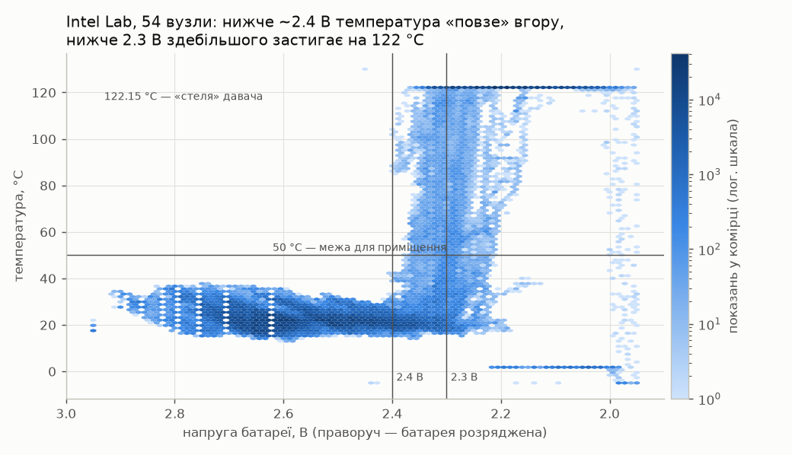
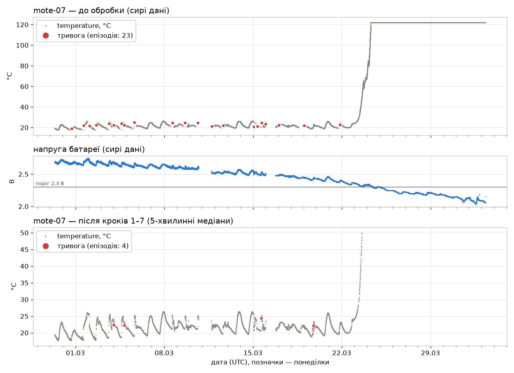

# Стадія 4. Реальні дані

**Мета:** перевірити детектори на справжніх даних давачів, з'ясувати, які
їхні тривоги хибні, і доопрацювати попередню обробку так, щоб хибних стало
менше. Окремих балів стадія не має, але її результати — обов'язкова частина
підрозділу 3.2 записки, а вміння відрізнити аномалію від особливості даних
знадобиться на стадії 5.

[← До змісту](README.md)

---

## 4.1. Набір даних Intel Lab

У 2004 році в лабораторії Intel Research у Берклі (Каліфорнія) 54 бездротові
вузли Mica2Dot понад місяць, з 28 лютого по 5 квітня, кожні 31 секунду
надсилали чотири показники: температуру, вологість, освітленість і напругу
батареї. Разом — близько 2,3 млн рядків.

Це **справжні** дані зі справжніми вадами: розрядженими батареями,
перервами зв'язку, дублікатами і пристроями, яких немає в переліку. На
відміну від вашого варіанта, **еталонних відповідей тут немає**: які тривоги
хибні, вирішуєте й обґрунтовуєте ви.

Джерело: <https://db.csail.mit.edu/labdata/labdata.html>. Автори дозволяють
вільно використовувати дані й просять посилатися на них, тож набір
**обов'язково** має бути у списку джерел записки (приклад — у
[розділі про звіт](07-zvit.md)).

---

## 4.2. Завантаження і перетворення

Одна команда з папки проєкту (віртуальне середовище активне):

```bash
python realdata/intel_lab.py
```

Скрипт:

1. завантажує у папку проєкту `data.txt.gz` (34 МБ) і `mote_locs.txt`
   (координати вузлів), якщо їх там ще немає;
2. читає журнал, переводить місцевий час лабораторії в UTC і друкує звіт про
   якість даних;
3. записує `intel_lab.parquet` — у **тому самому форматі, що й ваш варіант**,
   тож на ньому працює весь ваш код, — а також маніфест `intel_lab.json` і
   таблицю по вузлах `intel_lab_motes.csv`.

Триває 10–20 секунд і потребує близько 1 ГБ пам'яті: на ноутбуці з 4–8 ГБ
спершу закрийте браузер.

Справжній вивід:

```
Завантажую https://db.csail.mit.edu/labdata/data.txt.gz
  data.txt.gz: готово, 34.4 МБ
Завантажую https://db.csail.mit.edu/labdata/mote_locs.txt
  mote_locs.txt: готово, 0.6 КБ
Читаю data.txt.gz (2,3 млн рядків)…

=== Звіт про якість даних ===
Рядків у файлі          : 2 313 682
  не розібрано          : 0
  без номера вузла      : 526 (відкинуто)
  з нерозпізнаним часом : 0 (відкинуто)
Придатних рядків        : 2 313 156
Період, UTC             : 2004-02-28 08:58 – 2004-04-05 18:02 (37.4 доби)
  у поясі America/Los_Angeles: 2004-02-28 00:58 – 2004-04-05 11:02

Вузлів у mote_locs.txt  : 54; з даними: 54
  записів на вузол      : мін 35, медіана 43 443, макс 65 694
  дуже мало записів     : mote-05 (35), mote-15 (2 337)
Вузли, яких НЕМАЄ в mote_locs.txt: mote-55 (2 851), mote-56 (2 507), mote-57 (3), mote-58 (4 502), mote-6485 (1), mote-33117 (1), mote-65407 (1)

Порожні поля (показання відсутнє):
  temperature : 375
  humidity    : 376
  light       : 93 352
  voltage     : 0
  освітленості немає взагалі у: mote-05, mote-28, mote-57, mote-6485, mote-33117, mote-65407

Інтервал між записами вузла: медіана 33 с (за документацією 31 с)
  перерв > 10 хв      : 6 166 (на вузол: медіана 67, макс 337)
  найдовша перерва      : 27.3 год (mote-34)
  мовчала вся мережа    : з 2004-03-10 17:06 UTC, 24.5 год
  мовчала вся мережа    : з 2004-03-16 00:02 UTC, 19.0 год
  мовчала вся мережа    : з 2004-04-02 23:32 UTC, 11.7 год
  мовчала вся мережа    : з 2004-04-03 15:48 UTC, 6.1 год
  мовчала вся мережа    : з 2004-04-04 00:51 UTC, 8.8 год

Розряд батарей: показань з напругою < 2.3 В: 403 751 (17.5 %)
  серед них температура > 50 °C: 91.7 %; серед решти: 2.0 %
  значення 122.153 °C (стеля давача): 370 196

Поза фізичними межами:
  temperature  [0, 50]: нижче 539, вище 407 597   (мін -38.4, макс 385.568)
  humidity     [0, 100]: нижче 295 183, вище 3 901   (мін -8983.13, макс 137.512)
  light        [0, 100000]: нижче 0, вище 0   (мін 0, макс 1847.36)
  voltage      [2, 3.3]: нижче 2 113, вище 1   (мін 0.00910083, макс 18.56)

Дублікати: той самий вузол і та сама секунда: 323 (з них повністю однакових: 31)
  повторів номера epoch у того самого вузла: 113 610 — після
  перезапуску вузла лічильник іде спочатку, тож epoch не є ні часом, ні ключем

Записано intel_lab.parquet: рядків 9 158 521, 21.9 МБ
  за показниками: temperature 2 312 781, humidity 2 312 780, light 2 219 804, voltage 2 313 156
Записано intel_lab.json і intel_lab_motes.csv
Готово за 10 с.
```

**Перевірка.** У папці проєкту з'явилися `intel_lab.parquet`,
`intel_lab.json` та `intel_lab_motes.csv`, а останні рядки виводу такі самі,
як вище.

**Якщо завантаження не вдалося** (немає інтернету, університетський проксі),
скрипт надрукує обидві адреси. Завантажте файли браузером, покладіть у папку
проєкту і запустіть скрипт ще раз. Розпаковувати `data.txt.gz` не треба;
якщо браузер (Safari) розпакував його сам у `data.txt`, скрипт прийме і
такий файл.

**Увага.** Не відкривайте `data.txt` в Excel: у ньому 2,3 млн рядків, а
аркуш Excel вміщує трохи більше мільйона, тож ви побачите менше половини
даних і навіть не помітите цього. Малі таблиці (`intel_lab_motes.csv`,
`alarms.csv`) в Excel відкривати можна: **Дані → З тексту/CSV**, роздільник —
кома.

### Час: чому UTC

У файлі записано **місцевий** час лабораторії (Каліфорнія, UTC−8, а з
4 квітня — UTC−7). У проєкті весь час — в UTC, тож скрипт переводить його.
Наслідок, про який варто пам'ятати: ранок у лабораторії, 07:00, — це 15:00
за UTC і 17:00 за київським часом. Коли бачите на графіку подію «о 15:00»,
згадайте, котра година була в лабораторії. У записці вкажіть, у якому поясі
наводите час.

---

## 4.3. Проблеми даних: читаємо звіт

Звіт з 4.2 — це вже половина розділу «перелік виявлених проблем». Розберіть
кожен блок:

| Проблема | Що у звіті | Чим загрожує детекторам |
|---|---|---|
| Розряд батарей | 17,5 % показань при напрузі < 2,3 В; 370 196 разів рівно 122,153 °C | сотні тисяч неможливих значень, «застиглих» на стелі давача |
| Неможливі значення | температура до 385 °C, вологість до −8983 %, напруга до 18,56 В | тривоги, яких не було в приміщенні |
| Перерви | 6 166 перерв понад 10 хв; уся мережа мовчала до доби | вікно детектора «перестрибує» перерву і порівнює непорівнянне |
| Чужі пристрої | `mote-55`…`mote-58` і три зіпсовані номери, яких немає в `mote_locs.txt` | реальний аналог класу `rogue_device` з вашого варіанта |
| Неповні ряди | `mote-05` — 35 показань; `mote-28` ніколи не надсилав освітленості | ряд, на якому детектор нічого не може «вивчити» |
| Дублікати | 323 збіги «вузол + секунда»; `epoch` повторюється 113 610 разів | подвоєні точки, а видалення дублікатів за `epoch` знищило б 113 тис. справжніх |

Найцікавіша проблема — батареї. Ось усі 54 вузли разом: температура проти
напруги батареї (що темніша комірка, то більше там показань):



Поки напруга вища за 2,4 В, температура звичайна для приміщення (15–38 °C).
Між 2,4 і 2,3 В вона «повзе» вгору, нижче 2,3 В здебільшого застигає на
122 °C. Давач не нагрівся — він бреше, бо йому бракує живлення.

**Ваше завдання тут.** Відкрийте `intel_lab_motes.csv` і знайдіть три вузли з
найбільшою часткою показань при низькій напрузі (`low_voltage_share`) і три —
з найбільшою кількістю перерв (`gaps_over_10min`). Їх ви розглядатимете
далі.

---

## 4.4. До і після: як обробка змінює кількість тривог

```bash
python realdata/clean.py --plot mote-07
```

Скрипт запускає простий детектор (ковзна робастна z-оцінка) на температурі
кожного вузла, а потім по одному додає кроки обробки й після **кожного**
кроку рахує тривоги знову:

| Крок | Що робить | Навіщо |
|---|---|---|
| 1 | прибирає дублікати (вузол + показник + секунда) | подвоєні точки |
| 2 | лишає лише вузли з `mote_locs.txt` | чужі й зіпсовані номери |
| 3 | відкидає всі показники вузла в ті секунди, коли напруга < 2,3 В | розряд батареї |
| 4 | відкидає значення поза фізичними межами (0–50 °C тощо) | неможливі значення |
| 5 | не дає вікну детектора перетинати перерви понад 15 хв | перерви зв'язку |
| 6 | рахує 5-хвилинні медіани | дрібний шум і нерівний інтервал |
| 7 | прибирає тривоги, що спрацювали одночасно на чверті й більше вузлів | події всієї будівлі |

Справжній вивід (рядки поступу пропущено):

```
Детектор: ковзна робастна z-оцінка, вікно 120 точок, поріг 5; показник: temperature
…
Крок                                           Показань  Неможл.     Точок  На смітті  Епізодів  Вузлів
0. сирі дані                                  2 312 781  408 136    55 060        6 %     1 556      55
1. без дублікатів (вузол+показник+секунда)    2 312 463  408 081    55 080        6 %     1 556      55
2. лише вузли з mote_locs.txt                 2 302 602  408 078    54 913        6 %     1 546      53
3. без показань при напрузі < 2.3 В           1 899 221   37 489    54 204        2 %     1 482      53
4. фізичні межі (temperature 0…50)            1 861 732        0    53 131        0 %     1 442      53
5. вікно не перетинає перерв > 15 хв          1 861 732        0    49 422        0 %     1 254      53
6. + 5-хвилинні медіани                         304 942        0     5 357        0 %     1 222      53
7. + без подій усієї будівлі                    304 942        0       843        0 %       336      51

Епізодів тривог: 1 556 -> 336 (-78 %)
Неможл. — значення поза фізичними межами, що лишилися в даних. Детектор
їх майже не помічає: ковзна медіана швидко звикає до «застиглих»
неможливих значень (122 °C, -4 %) і далі вважає їх нормою.
Показань у рядках 6–7 — це 5-хвилинні медіани, тож «Точок» там
не порівнюйте з рядками 0–5; порівнюйте «Епізодів».
На смітті — частка «Точок» на показаннях, які прибирають кроки 2–4
(вузол не з mote_locs.txt, розряд батареї, поза межами); з кроку 4 — 0.

Коли починаються епізоди (місцевий час лабораторії):
  до обробки   : 07:00–07:59 — 46 %, 08:00–08:59 — 9 %, 18:00–18:59 — 6 %, 13:00–13:59 — 5 %
  після обробки: 07:00–07:59 — 13 %, 16:00–16:59 — 12 %, 18:00–18:59 — 12 %, 10:00–10:59 — 8 %
  найбільше після обробки: mote-09 (12), mote-32 (12), mote-21 (11), mote-22 (11), mote-46 (11)

Записано intel_lab_clean.parquet (рядків: 7 477 479) і alarms.csv (епізодів до: 1 556, після: 336)
Рисунок: mote-07_temperature.png
Готово за 14 с.
```

Що означають стовпці:

- **Показань** — скільки значень температури лишилося після кроку;
- **Неможл.** — скільки з них поза фізичними межами;
- **Точок** — скільки значень детектор позначив;
- **На смітті** — яка частка цих позначок припала на «сміття»: показання
  вузлів поза переліком, при розрядженій батареї або поза фізичними межами
  (саме їх прибирають кроки 2–4, тож з кроку 4 тут 0 %);
- **Епізодів** — скільки окремих тривог: позначки одного вузла, між якими
  менше 30 хв, — це один епізод. Саме епізоди порівнюйте між рядками;
- **Вузлів** — на скількох вузлах була хоч одна тривога.

Скрипт також записує:

- `intel_lab_clean.parquet` — дані після кроків 1–4, у тому самому форматі;
- `alarms.csv` — усі епізоди до (`before`) і після (`after`) обробки, з
  часом початку в UTC і за місцевим часом лабораторії;
- `mote-07_temperature.png` — рисунок для записки:



Вгорі — сирі дані з 23 епізодами тривог і злетом до 122 °C, посередині —
напруга батареї, що перетинає 2,3 В саме тоді, коли температура «злітає»,
унизу — ряд після обробки з 4 епізодами.

**На що звернути увагу** (і пояснити у записці своїми словами):

1. Кроки 3–4 прибрали понад 400 тис. неможливих значень, а епізодів поменшало
   лише на сотню. Чому? Підказка — в останніх рядках виводу і на верхній
   панелі рисунка: що бачить ковзна медіана через годину після «злету» до
   122 °C?
2. Найбільше скоротив тривоги крок 7. Подивіться, о котрій годині
   починалася майже половина епізодів **до** обробки. Що відбувається в
   офісній лабораторії о 07:00 на багатьох вузлах одночасно?
3. Деякі тривоги **після** обробки все одно хибні — див. 4.6.

---

## 4.5. Ваш детектор на реальних даних

Вказівки вимагають застосувати до реальних даних **ваші** детектори зі
стадії 3. `clean.py` запускає будь-який із них замість вбудованого — так
само по черзі на кожному вузлі й після кожного кроку обробки:

```bash
python realdata/clean.py --detector baseline
python realdata/clean.py --detector ewma
```

Для призначеного методу пишіть його назву: `ewma`, `stl_esd`,
`matrix_profile`, `isolation_forest` або `lof` (бібліотеку методу має бути
встановлено, як на стадії 3). Метод працює з тими самими типовими
параметрами, що й на стадії 3, на 5-хвилинній сітці (STL+ESD — на
15-хвилинній). Змінити параметри можна ключем `--method-args` — у лапках,
**з пробілом** між назвою і значенням, як у командному рядку стадії 3:

```bash
python realdata/clean.py --detector matrix_profile --method-args "--window 6h"
```

**Увага.** Деякі методи працюють довго, бо проходять 54 вузли вісім разів:
вбудований, базовий і EWMA — до пів хвилини, Matrix Profile — близько
хвилини, LOF — 2–3 хвилини, Isolation Forest — близько 3, STL+ESD — 5–15
хвилин. Запускайте і займіться чимось іншим.

### Два типи детекторів

**Порогові** (вбудований, базовий, EWMA) позначають усе, що виходить за
поріг. Чим чистіші дані, тим менше тривог. Справжній вивід для EWMA:

```
Детектор: detect/methods/ewma.py (EWMA: λ=0.1, L=5, еталон — перші 7 діб, профіль workdays; сітка 5min); показник: temperature
…
Крок                                           Показань  Неможл.     Точок  На смітті  Епізодів  Вузлів
0. сирі дані                                  2 312 781  408 136   576 412       75 %     1 205      54
1. без дублікатів (вузол+показник+секунда)    2 312 463  408 081   576 271       75 %     1 206      54
2. лише вузли з mote_locs.txt                 2 302 602  408 078   576 173       75 %     1 204      53
3. без показань при напрузі < 2.3 В           1 899 221   37 489   183 504       20 %       601      53
4. фізичні межі (temperature 0…50)            1 861 732        0   145 962        0 %       506      52
5. вікно не перетинає перерв > 15 хв          1 861 732        0    64 419        0 %       266      52
6. + 5-хвилинні медіани                         304 942        0    11 206        0 %       276      52
7. + без подій усієї будівлі                    304 942        0     8 336        0 %       257      51

Епізодів тривог: 1 205 -> 257 (-79 %)
Неможл. — значення поза фізичними межами, що лишилися в даних. EWMA
порівнює кожну точку з «нормою» першого тижня ряду, тож неможливі
значення позначає майже всі — звідси великі «Точок» і «На смітті».
Показань у рядках 6–7 — це 5-хвилинні медіани, тож «Точок» там
не порівнюйте з рядками 0–5; порівнюйте «Епізодів».
На смітті — частка «Точок» на показаннях, які прибирають кроки 2–4
(вузол не з mote_locs.txt, розряд батареї, поза межами); з кроку 4 — 0.
```

**«Частка ряду»** (STL+ESD, Matrix Profile, Isolation Forest, LOF) щоразу
позначають приблизно сталу частку найнезвичніших точок кожного ряду. Тому
після очищення кількість тривог майже не падає — змінюється те, **що**
позначено. Справжній вивід для LOF:

```
Детектор: detect/methods/lof.py (LOF: сусідів 300, contamination 0.02, вікно ознак 2h; сітка 5min); показник: temperature
…
Крок                                           Показань  Неможл.     Точок  На смітті  Епізодів  Вузлів
0. сирі дані                                  2 312 781  408 136    32 848       70 %       858      55
1. без дублікатів (вузол+показник+секунда)    2 312 463  408 081    32 321       70 %       833      55
2. лише вузли з mote_locs.txt                 2 302 602  408 078    32 202       70 %       818      52
3. без показань при напрузі < 2.3 В           1 899 221   37 489    30 607       25 %     1 155      53
4. фізичні межі (temperature 0…50)            1 861 732        0    34 207        0 %     1 459      53
5. вікно не перетинає перерв > 15 хв          1 861 732        0    35 144        0 %     1 685      52
6. + 5-хвилинні медіани                         304 942        0     5 936        0 %     1 733      52
7. + без подій усієї будівлі                    304 942        0     2 252        0 %       780      52

Епізодів тривог: 858 -> 780 (-9 %)
Неможл. — значення поза фізичними межами, що лишилися в даних.
Цей метод щоразу позначає приблизно сталу частку кожного ряду, тож після
очищення тривоги не зникають, а переходять на інші точки: дивіться, ЩО
позначено («На смітті»), а не лише скільки. Після кроку 5 кожен шматок
ряду дістає власну частку — тому епізодів там може стати більше.
Показань у рядках 6–7 — це 5-хвилинні медіани, тож «Точок» там
не порівнюйте з рядками 0–5; порівнюйте «Епізодів».
На смітті — частка «Точок» на показаннях, які прибирають кроки 2–4
(вузол не з mote_locs.txt, розряд батареї, поза межами); з кроку 4 — 0.
```

До очищення 70 % позначок LOF припадали на сміття (розряджені батареї,
неможливі значення), після — 0 %: тепер метод показує найнезвичнішу
поведінку справжніх даних. Ріст епізодів після кроків 3–5 — не помилка, а
властивість методу: менше сміття → «незвичними» стають інші точки, а
розрізаний перервами ряд дає кожному шматку власну частку.

**У звіт.** Таблиця «до/після» для вашого призначеного детектора і
пояснення: які кроки обробки найбільше вплинули саме на нього і чому. Для
методів «частки ряду» порівнюйте стовпець «На смітті», а не лише кількість
епізодів.

---

## 4.6. Які тривоги хибні — ваш аналіз

Це та частина, яку за вас не зробить жоден скрипт.

1. Відкрийте `alarms.csv`. Рядки `after` — тривоги, що лишилися після
   обробки. Стовпець `start_local` — час початку за годинником лабораторії.
2. Візьміть 3–5 вузлів з найбільшою кількістю тривог (скрипт друкує їх у
   рядку «найбільше після обробки») і для кожного побудуйте рисунок:

   ```bash
   python realdata/clean.py --plot mote-09
   ```

   Розглядаєте тривоги свого призначеного детектора — додайте той самий
   ключ, з яким їх отримали (наприклад, `--detector ewma`): без нього скрипт
   намалює тривоги вбудованого детектора і перезапише ними `alarms.csv`.

3. Для кожної тривоги вирішіть: це справжня аномалія (несправність,
   незвичайна подія) чи нормальна поведінка, яку детектор помилково вважає
   аномалією? Аргументуйте: час доби, день тижня, сусідні вузли (координати —
   у `intel_lab.json`), напруга батареї, освітленість у той самий момент
   (`--metric light`).
4. Спробуйте змінити обробку і подивіться, що зміниться:
   - `--min-voltage 2.4` — суворіший поріг батареї: скільки показань ви
     втратите і скільки хибних тривог приберете? Чи варто?
   - `--metric humidity`, `--metric light` — ті самі кроки для інших
     показників.
   - `--window 240 --z 6` — інші налаштування детектора.

Правильної відповіді немає — є переконливе чи непереконливе обґрунтування.
Його й оцінюють.

---

## У звіт (підрозділ 3.2)

- Перелік проблем реальних даних з числами зі звіту `intel_lab.py` (таблиця
  з 4.3, але з вашими формулюваннями).
- Вжиті заходи: кроки обробки і чому кожен потрібен.
- Таблиця «до/після» для базового і вашого призначеного детектора
  (епізоди тривог після кожного кроку).
- Рисунки: `mote-07_temperature.png` і ваші рисунки з 4.6.
- Обґрунтування, які тривоги хибні і чому; що з цього ви перенесли у
  попередню обробку своїх детекторів.
- У якому часовому поясі наведено час.
- Посилання на набір Intel Lab у списку джерел.

---

## Контрольний список стадії 4

- [ ] `intel_lab.py` створив `intel_lab.parquet`, `intel_lab.json` і
      `intel_lab_motes.csv`.
- [ ] Ви можете пояснити кожен блок звіту про якість даних.
- [ ] `clean.py` надрукував таблицю «до/після» для базового детектора і для
      вашого призначеного.
- [ ] Ви розглянули щонайменше три вузли з тривогами після обробки і
      вирішили, які тривоги хибні.
- [ ] Набір Intel Lab — у списку джерел.

[← Стадія 3](03-detektory.md) · [Далі: стадія 5 →](05-poshuk.md)
