# Стадія 5. Пошук інцидентів у власному варіанті

**Мета:** знайти приховані інциденти у **вашому** наборі даних і оформити їх у
`findings.json`. Це 30 балів зі 100 — найбільший складник оцінки.

Це єдина частина проєкту, для якої посібник **не дає** готового коду. Тут
описано, що шукати і як оформити результат, а сам пошук — ваша робота. Саме її
комісія перевірить на захисті, коли вам дадуть незнайомий набір даних.

[← До змісту](README.md)

---

## 5.1. Що відомо заздалегідь

- У вашому варіанті приховано **від 5 до 8 інцидентів**.
- Усі вони належать до **12 класів** з розділу 7 вказівок. Інших не буває.
- Кількість, класи, час і пристрої у кожного студента свої.
- Частину інцидентів не видно в жодному окремому показнику: їх знаходять,
  лише зіставляючи кілька пристроїв (класи `zone_incoherence`,
  `gateway_group_loss`, `exfil_pattern`, `sensor_swap`, а також `drift`).

## 5.2. Як рахуються бали

Повністю правила — у п. 6.2 вказівок. Головне:

| Правило | Що це означає для вас |
|---|---|
| Оцінюються не більше 15 знахідок з найвищою `confidence` | Не надсилайте «про всяк випадок» 50 знахідок — зайві просто відкинуть |
| Щонайменше п'ята частина пристроїв, указаних у знахідці, має належати до інциденту | Не перелічуйте всі пристрої будівлі в одній знахідці |
| Час має перекриватися не менше ніж на 25 % | Вікно не повинно бути ні набагато ширшим, ні набагато вужчим за інцидент |
| Повторна знахідка того самого інциденту — хибне спрацювання | Одна подія — одна знахідка |
| Кожне хибне спрацювання — мінус 5 % (не більше 30 %) | Сумнівні знахідки краще не подавати: штраф не залежить від `confidence`, вона лише визначає, які 15 знахідок оцінюються |
| Правильний час, але не той клас — 70 % балів | Назву класу пишіть точно як у розділі 7 |

Складні інциденти важать 2,5, середні — 1,5, прості — 1,0.

---

## 5.3. Порядок роботи

1. **Огляд.** Порахуйте, скільки повідомлень надсилає кожен пристрій щогодини
   (скрипт обробки зі стадії 2 уже це вміє), і порівняйте перелік пристроїв у
   даних і в маніфесті.
2. **Від простого до складного.** Спочатку прості класи (`stuck_at`,
   `outage`, `spike_storm`, `rogue_device`) — вони дають упевненість і
   знайомство з даними. Потім середні, наприкінці складні.
3. **Кожного кандидата — на графік.** Детектор каже «тут щось є», а графік
   показує, що саме і де межі. Скрипти стадії 3 зберігають такі графіки.
4. **Записуйте знахідки одразу** в таблицю `my_findings.csv` (див. 5.5), не
   відкладайте на кінець.
5. **Упевненість.** 0,9 — бачите на графіку однозначно; 0,6 — схоже, але є
   сумніви; нижче 0,5 — краще не подавати. Пам'ятайте: низька упевненість
   не зменшує штрафу за хибну знахідку.
6. **Самоперевірка.** Зберіть `findings.json` і проженіть `selfcheck.py`.

**Порада.** Перш ніж шукати у своєму варіанті, спробуйте свій підхід на
навчальному наборі, де відповіді відомі (`tuning_truth.json`). Якщо там клас не
знаходиться, у вашому варіанті він теж не знайдеться.

**Наперед.** На захисті ваш пошук запускатиметься на незнайомих даних
([крок 8.2](08-zakhyst.md)), тож уже зараз записуйте **правила**, за якими
знаходите кожен клас (який показник, яке вікно, який поріг, з чим
порівнюєте). Згодом ви перенесете їх у код — файл `hunt.py`.

---

## 5.4. Атлас інцидентів

Нижче — як виглядає кожен клас на навчальному наборі. Помаранчева смуга — час
інциденту за відповідями. У вашому варіанті ті самі класи виглядатимуть
схоже, але на інших пристроях, в інший час і з іншою силою.

### Прості

#### `stuck_at` — давач «завмирає»

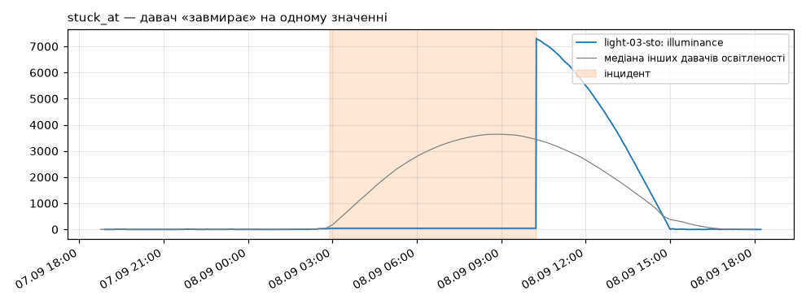

**Що шукати:** години, коли показання не змінюється або майже не змінюється,
хоча подібні давачі в цей час змінюються. **Чим:** кількість різних значень
або стандартне відхилення в рухомому вікні.

#### `outage` — пристрій мовчить

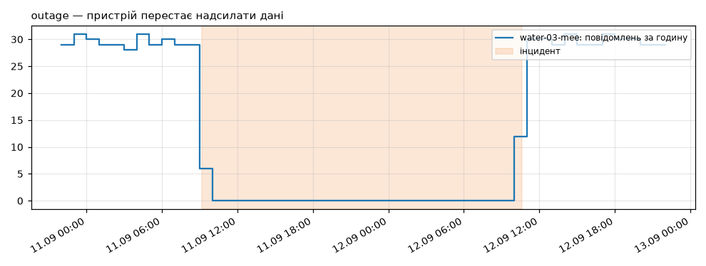

**Що шукати:** проміжок між повідомленнями пристрою, набагато довший за його
номінальний інтервал (`interval_s` у маніфесті). **Чим:** різниця між
сусідніми мітками часу кожного пристрою.

#### `spike_storm` — фізично неможливі значення

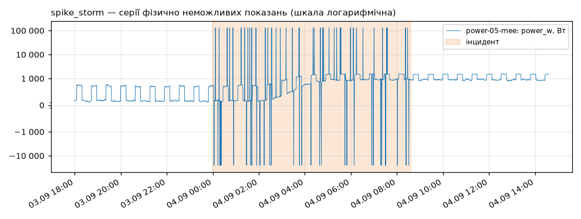

**Що шукати:** серії значень, яких не може бути: від'ємна потужність,
сотні кіловат для офісного приладу, вологість понад 100 %. **Чим:** межі
фізично можливого для кожного показника (одиниці — у маніфесті) і робастна
z-оцінка.

#### `rogue_device` — чужий пристрій

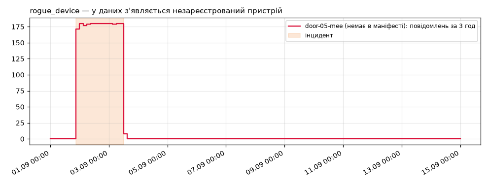

**Що шукати:** `device_id`, який є в даних, але відсутній у маніфесті. Час
інциденту — від першого до останнього повідомлення цього пристрою.

### Середньої складності

#### `drift` — повільний дрейф

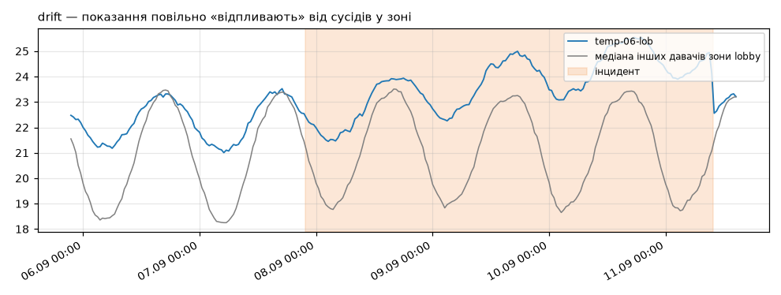

**Що шукати:** показання протягом днів поступово відходять від інших давачів
того самого типу в тій самій зоні. **Чим:** різниця між пристроєм і медіаною
зони; EWMA або кумулятивна сума цієї різниці.

#### `clock_skew` — зсув годинника

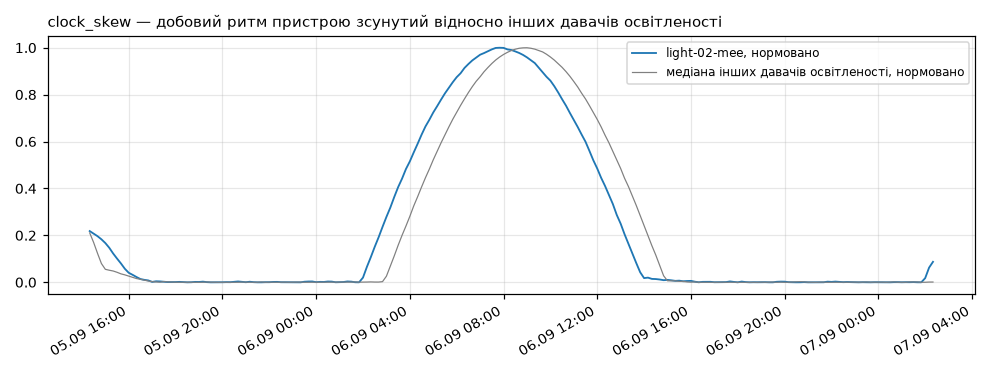

**Що шукати:** добовий ритм пристрою зсунутий у часі відносно подібних
пристроїв. **Чим:** взаємна кореляція пристрою з медіаною подібних за кожну
добу і зсув, за якого вона найбільша.

#### `beaconing` — підозріло рівні інтервали

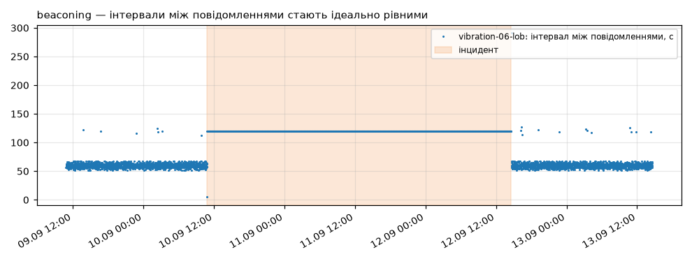

**Що шукати:** звичайні пристрої надсилають дані з невеликим розкидом у часі.
Коли інтервали між повідомленнями раптом стають ідеально однаковими, це ознака
керованої активності. **Чим:** стандартне відхилення інтервалів у рухомому
вікні, яке падає майже до нуля.

#### `energy_anomaly` — споживання в неробочий час

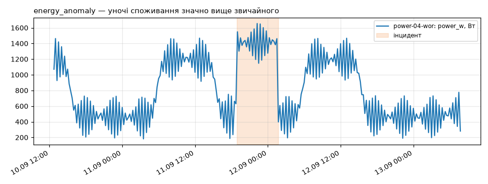

**Що шукати:** уночі чи у вихідні споживання значно вище, ніж у ту саму годину
інших діб. **Чим:** порівняння з типовим профілем «година доби → споживання»;
якщо в зоні є давач руху — перевірка, чи там справді хтось був.

### Складні

#### `zone_incoherence` — давачі зони суперечать одне одному

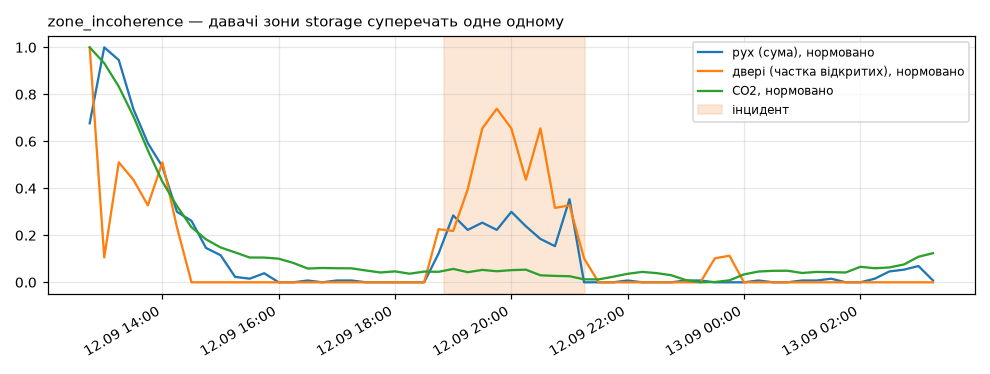

**Що шукати:** у межах однієї зони показники присутності людей розходяться:
двері відчиняються і є рух, а CO2 не росте, або навпаки. **Чим:** зведіть
показники зони в одну таблицю за 15-хвилинними інтервалами і порівнюйте їх між
собою.

#### `gateway_group_loss` — втрати за одним шлюзом

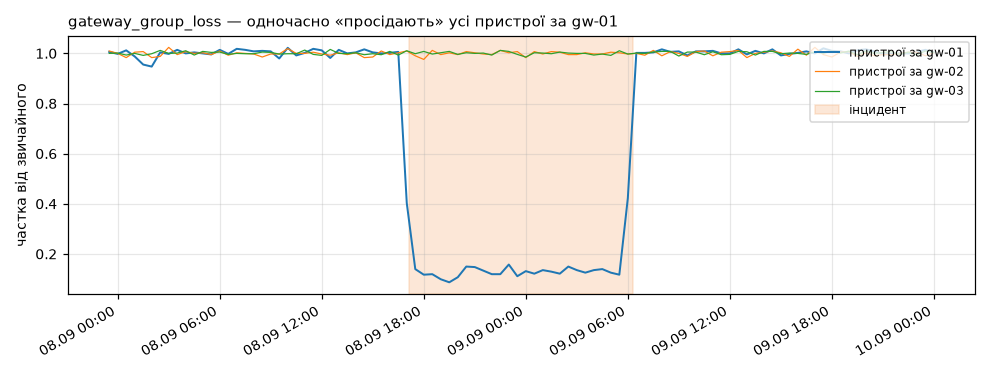

**Що шукати:** **одночасне** падіння кількості повідомлень у всіх пристроїв за
одним шлюзом (поле `gateway` у маніфесті), тоді як за іншими шлюзами все
гаразд. **Чим:** частота повідомлень за групами шлюзів. У знахідці перелічіть
постраждалі пристрої, а не всю будівлю.

#### `exfil_pattern` — шлюз відправляє забагато

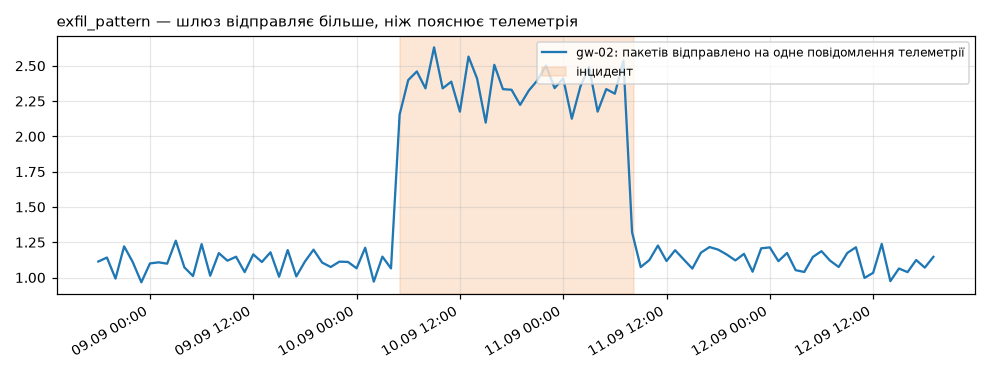

**Що шукати:** лічильник відправлених пакетів шлюзу (`pkt_sent`) росте
швидше, ніж пояснює кількість повідомлень від пристроїв за ним. **Чим:**
відношення приросту `pkt_sent` до кількості повідомлень за той самий час.

#### `sensor_swap` — давачі помінялися

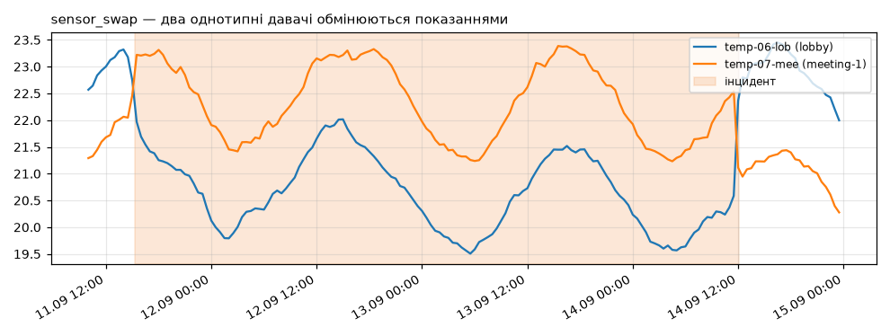

**Що шукати:** два однотипні давачі в різних зонах раптом «обмінюються»
поведінкою: кожен починає показувати те, що досі показував інший. **Чим:**
порівняння кожного пристрою з його власною історією і з іншими пристроями того
самого типу. У знахідці — обидва пристрої.

---

## 5.5. Оформлення `findings.json`

Вести знахідки вручну в JSON незручно і легко помилитися з дужкою. Тому
ведіть їх у таблиці, а JSON зберіть скриптом.

### Крок 1. Таблиця знахідок

Створіть файл `my_findings.csv` (у VS Code, Excel чи LibreOffice Calc). Перший
рядок — назви колонок, далі по рядку на знахідку. Приклад для навчального
набору:

```
devices,class,start,end,confidence,evidence
power-05-mee,spike_storm,2025-09-04T00:05:00Z,2025-09-04T08:30:00Z,0.95,73 показання потужності поза фізично можливим діапазоном
"gw-01;temp-01-sto;temp-03-sto",gateway_group_loss,2025-09-08T17:15:00Z,2025-09-09T06:10:00Z,0.8,частота повідомлень пристроїв за gw-01 впала до 13 %
power-04-wor,energy_anomaly,2025-09-11T19:00:00Z,2025-09-12T01:40:00Z,0.86,уночі споживання вдвічі вище звичайного
```

- Кілька пристроїв — через крапку з комою, у лапках.
- Час — у UTC, у форматі `РРРР-ММ-ДДTГГ:ХХ:ССZ`.
- В Excel зберігайте через **Файл → Зберегти як → CSV UTF-8 (розділювач —
  кома)**. Звичайний «CSV» з крапкою з комою і десятковою комою (`0,8`)
  теж прочитається, але скрипт попередить, що файл не в UTF-8.

Якщо кандидатів дав детектор з ключем `--json` (стадія 3, розділ 3.5),
відкрийте `windows.json` у VS Code і перенесіть у таблицю лише ті вікна, які
ви перевірили на графіку: `devices`, `start` і `end` — з JSON, а `class`,
`confidence` і `evidence` — ваші власні.

### Крок 2. Збирання JSON

```bash
python make_findings.py --csv my_findings.csv --data variant_NNN.parquet --manifest variant_NNN.json
```

На навчальному наборі:

```
Записано findings.json (знахідок: 3, варіант 0)

Тепер перевірте файл:
  python selfcheck.py --findings findings.json --data tuning.parquet --manifest tuning.json
```

Скрипт сам підставляє картку результатів з ваших даних і впорядковує
знахідки за упевненістю.

### Крок 3. Самоперевірка

```bash
python selfcheck.py --findings findings.json --data variant_NNN.parquet --manifest variant_NNN.json
```

Добивайтеся рядка:

```
Файл придатний до перевірки.
```

**Увага.** `selfcheck.py` перевіряє лише **формат** і картку. Він не каже,
чи правильні знахідки, — відповіді є тільки в керівника.

---

## 5.6. Що внести у звіт

Підрозділ 3.3 записки: таблиця всіх знахідок (пристрої, час, клас,
упевненість) і для **кожної** — графік і пояснення, на основі чого ви дійшли
висновку. Знахідка без обґрунтування на захисті викличе запитання.

---

## Контрольний список стадії 5

- [ ] Перелік пристроїв у даних порівняно з маніфестом.
- [ ] Для кожного з 12 класів ви знаєте, чи є він у вашому варіанті і чому
      ви так вважаєте.
- [ ] Кожна знахідка має графік і обґрунтування.
- [ ] Знахідок не більше 15, сумнівні прибрано.
- [ ] `selfcheck.py` пише «Файл придатний до перевірки».

[← Стадія 4](04-realni-dani.md) · [Далі: стадія 6 →](06-dashbord.md)
