# Стадія 6. Дашборд

**Мета:** показати стан мережі, окремий пристрій і знайдені аномалії в
дашборді, зробленому **призначеним** вам інструментом, — так, щоб ним міг
користуватися будь-хто, не лише ви. Складник «Дашборд» — 10 балів; його
оцінюють на демонстрації.

[← До змісту](README.md)

---

## 6.1. Що вже готово

У заготовці є три готові дашборди, по одному на кожен інструмент. Усі мають
однакові три сторінки — саме ті, яких вимагають вказівки (п. 4.6):

1. **Огляд мережі** — скільки пристроїв на зв'язку, карта «пристрій ×
   година» і зведення за зонами або шлюзами;
2. **Пристрій** — показники одного пристрою в часі; вікна знахідок з
   `findings.json` зафарбовано;
3. **Аномалії** — знахідки на шкалі часу і таблицею, з переходом на
   сторінку пристрою.

Ваш інструмент записано в маніфесті (`assigned_stack` → `dashboard`):

| Інструмент | Звідки бере дані | Що потрібно |
|---|---|---|
| Streamlit | прямо з файла Parquet (через DuckDB) | `pip install streamlit plotly` |
| Plotly Dash | прямо з файла Parquet (через DuckDB) | `pip install dash` |
| Grafana | з **вашого сховища** зі стадії 2 | Docker і один підготовчий скрипт |

Увесь час на всіх дашбордах — UTC.

Поки `findings.json` ще немає (до стадії 5), сторінка аномалій буде
порожньою — це нормально:

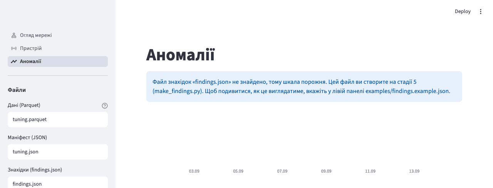

Щоб побачити, як вона виглядатиме, вкажіть приклад
`examples/findings.example.json` разом із навчальним набором.

---

## 6.2. Streamlit

### Встановлення і запуск

```bash
pip install streamlit plotly
```

```bash
streamlit run dashboard/streamlit_app.py -- --data variant_NNN.parquet --manifest variant_NNN.json --findings findings.json
```

**Увага.** Два дефіси `--` перед `--data` обов'язкові: усе, що після них,
Streamlit передає дашборду. Без них буде помилка `Error: No such option '--data'.`

Під час **першого** запуску Streamlit попросить адресу пошти
(`Email:`) — просто натисніть Enter. Далі (справжній вивід, адреси мережі
замінено на `…`):

```
Collecting usage statistics. To deactivate, set browser.gatherUsageStats to false.

  You can now view your Streamlit app in your browser.

  Local URL: http://localhost:8501
  Network URL: http://…:8501
  External URL: http://…:8501
```

Браузер відкриється сам; якщо ні — відкрийте <http://localhost:8501>.
Зупинити — Ctrl+C у терміналі. Шляхи до файлів можна змінити й просто в
лівій панелі, без перезапуску. Підказку про Watchdog на macOS можна
ігнорувати.

### Що побачите

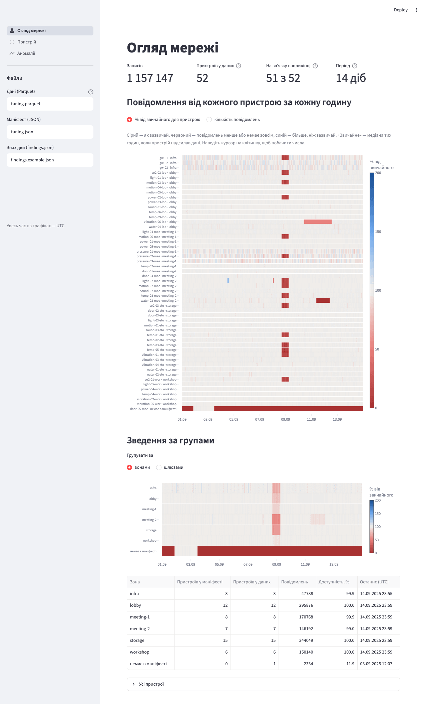

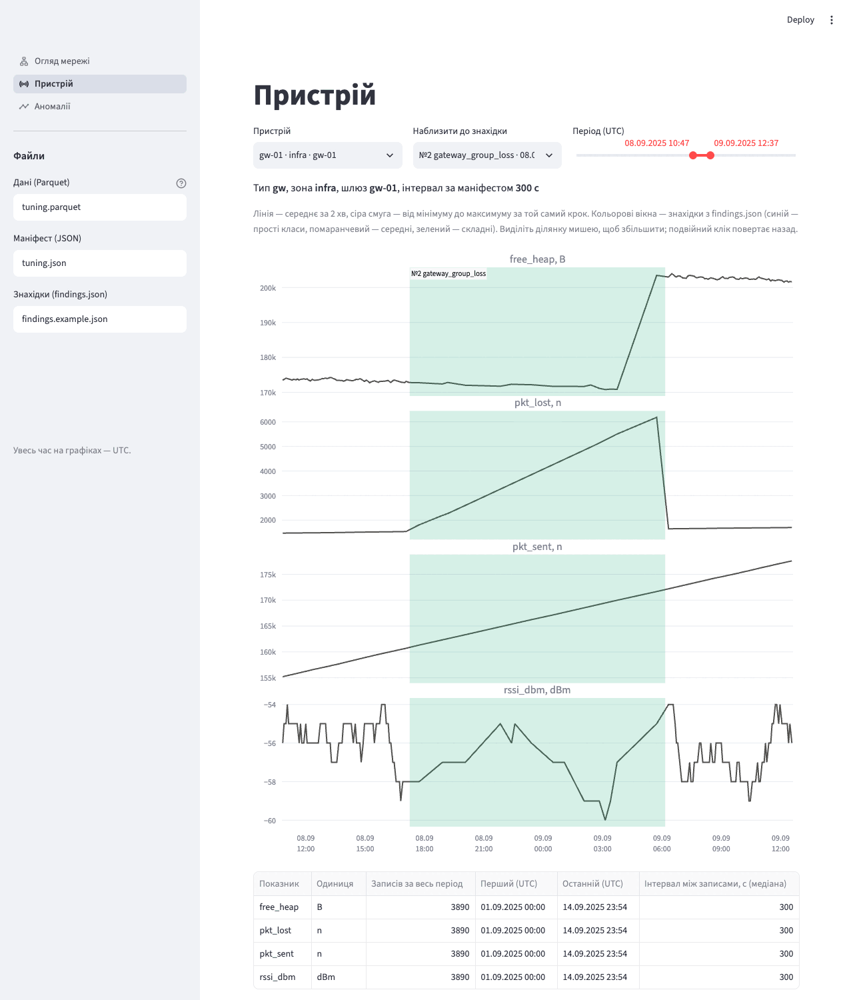

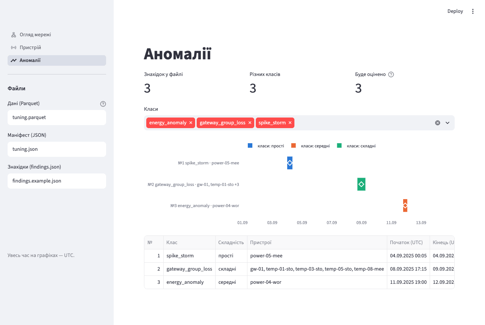

Посилання «відкрити» в таблиці аномалій відкриває сторінку пристрою одразу
на вікні цієї знахідки.

---

## 6.3. Plotly Dash

### Встановлення і запуск

```bash
pip install dash
```

```bash
python dashboard/dash_app.py --data variant_NNN.parquet --manifest variant_NNN.json --findings findings.json
```

Справжній вивід:

```
Дашборд: http://localhost:8050   (зупинка — Ctrl+C)
Dash is running on http://127.0.0.1:8050/

 * Serving Flask app 'dash_app'
 * Debug mode: off
WARNING: This is a development server. Do not use it in a production deployment. Use a production WSGI server instead.
 * Running on http://127.0.0.1:8050
Press CTRL+C to quit
```

Dash не відкриває браузер сам — відкрийте <http://localhost:8050>. Рядок
`WARNING … development server` для дашборда на власному комп'ютері — норма.
Після змін у `findings.json` просто оновіть сторінку (F5).

### Що побачите

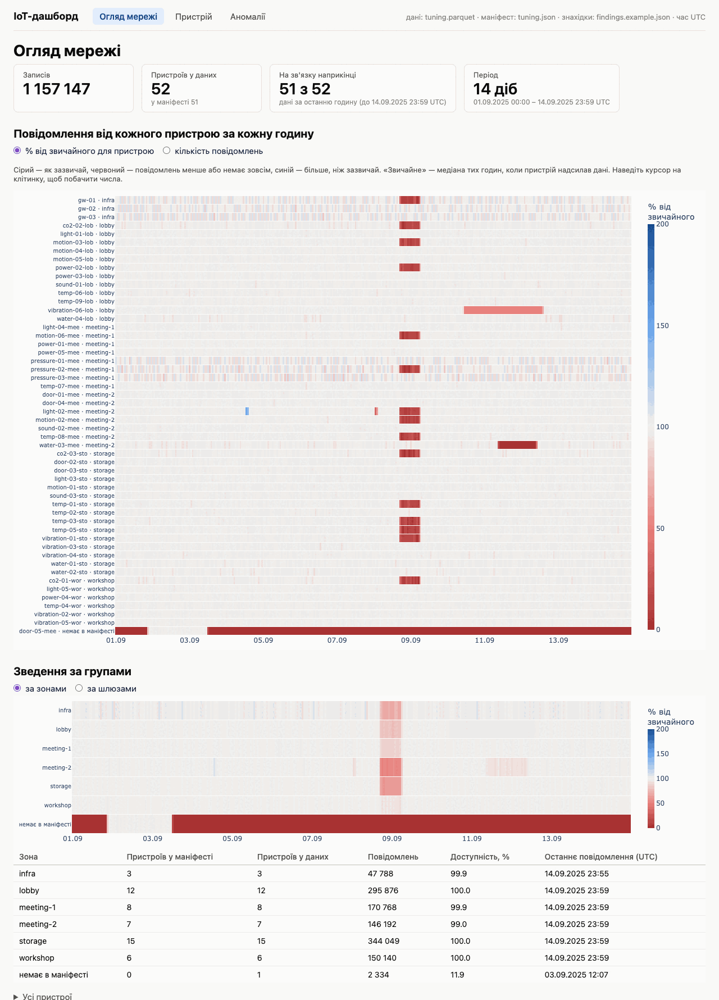

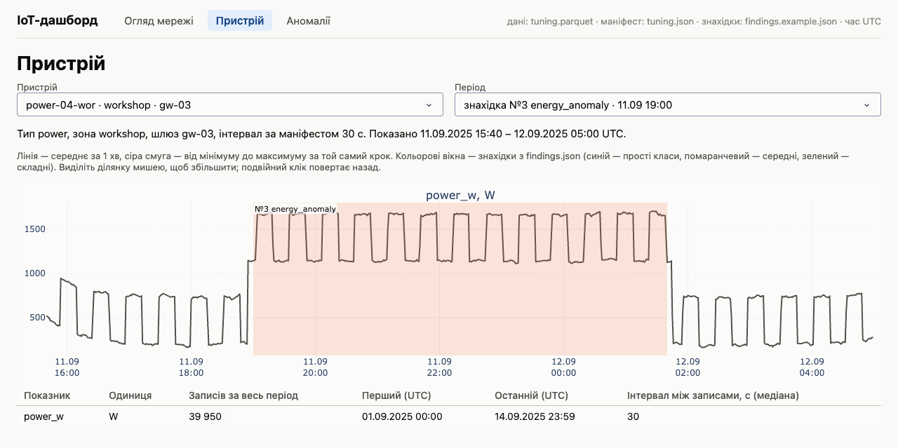

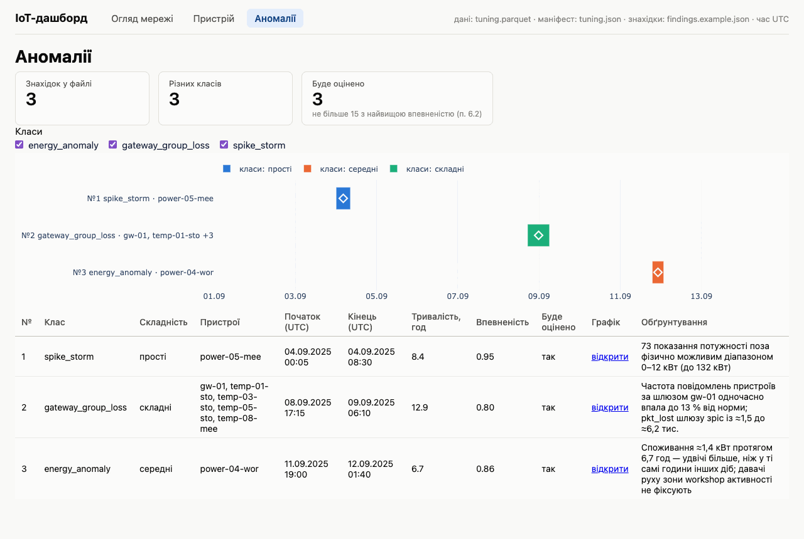

На сторінці пристрою період вибирають зі списку: увесь період, кожна
знахідка цього пристрою або окрема доба. Ділянку графіка можна виділити
мишею, подвійний клік повертає назад.

---

## 6.4. Grafana

Grafana працює в Docker (як сховища на стадії 2) і читає дані з **вашого**
сховища. Вона не вміє читати файли JSON, тому маніфест і знахідки спершу
записує у сховище підготовчий скрипт.

**Перед початком:**

- Docker Desktop запущено (стадія 2).
- Якщо ваше сховище InfluxDB чи TimescaleDB — його контейнер працює і в
  ньому ваші дані:
  `docker compose -f pipeline/docker-compose.yml up -d`.
- Перший запуск Grafana потребує інтернету: завантажується образ (1,3 ГБ) і
  модуль SQLite.

### Крок 1. Підготовка даних

```bash
python dashboard/grafana/prepare.py --manifest variant_NNN.json --data variant_NNN.parquet --findings findings.json
```

Сховище скрипт бере з маніфесту. Справжній вивід для SQLite на навчальному
наборі (у `tuning.json` записано InfluxDB, тому для навчального набору
додайте `--storage` зі своїм сховищем, наприклад `--storage sqlite`;
проміжні рядки поступу пропущено):

```
Сховище: sqlite; пристроїв у маніфесті: 51; знахідок: 3
Завантажую tuning.parquet у сховище (до кількох хвилин)…
…
  [sqlite] завантажено 1 157 147 рядків за 3.4 с — файл 90 МБ
Телеметрії у сховищі: 1 157 147 рядків.
Рахую підсумки за годину (таблиця hourly)…
Таблиці devices, units, hourly і findings записано.

Тепер запустіть Grafana (якщо ще не запущена):
    docker compose -f dashboard/grafana/docker-compose.yml up -d
і відкрийте http://localhost:3000
```

Якщо ваше сховище **DuckDB**, скрипт напише
`Grafana не читає DuckDB, тому телеметрія переноситься у SQLite.` і
створить у папці проєкту файл `iot.sqlite` (для варіанта — близько 0,5 ГБ).
Для InfluxDB і TimescaleDB дані вже у сховищі: скрипт лише дописує туди
маніфест і знахідки.

**Змінили `findings.json` — запустіть цю команду ще раз** і оновіть сторінку
в браузері.

**Увага.** `run_all.py` і `measure.py` замінюють дані у вашому сховищі тим
набором, на якому їх запускали. Щоб Grafana знову показувала ваш варіант,
повторіть команду з ключем `--reload`:

```bash
python dashboard/grafana/prepare.py --manifest variant_NNN.json --data variant_NNN.parquet --findings findings.json --reload
```

### Крок 2. Запуск Grafana

```bash
docker compose -f dashboard/grafana/docker-compose.yml up -d
```

Перший запуск триває близько хвилини (завантаження образу), наступні — кілька
секунд. Може з'явитися попередження
`a network with name kursova_default exists but was not created for project …` —
це нормально: Grafana навмисно під'єднується до мережі ваших сховищ.

Відкрийте <http://localhost:3000> — початкова сторінка відкривається без
входу:

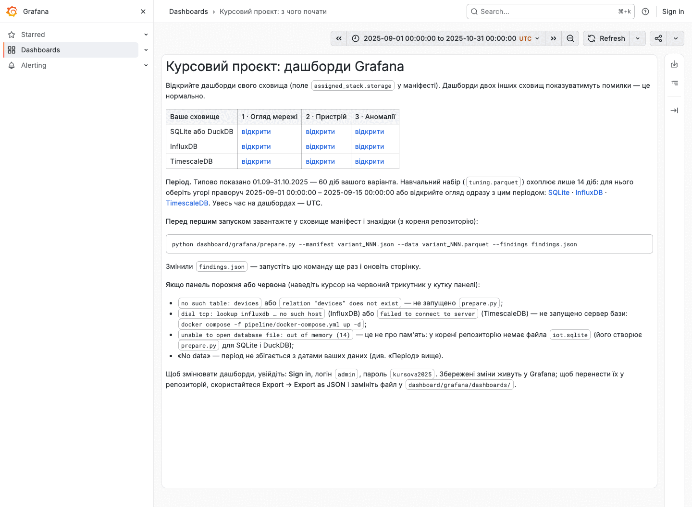

Відкривайте дашборди **свого** сховища з таблиці: дашборди двох інших
показуватимуть помилки, так і має бути. Для навчального набору виберіть угорі
праворуч період 2025-09-01 – 2025-09-15 (або скористайтеся посиланнями на
сторінці): типово показано 60 діб вашого варіанта.

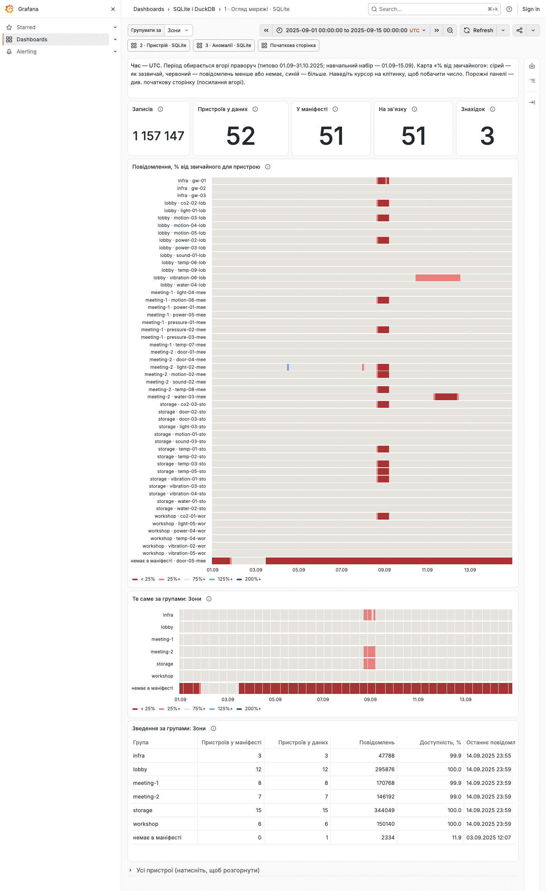

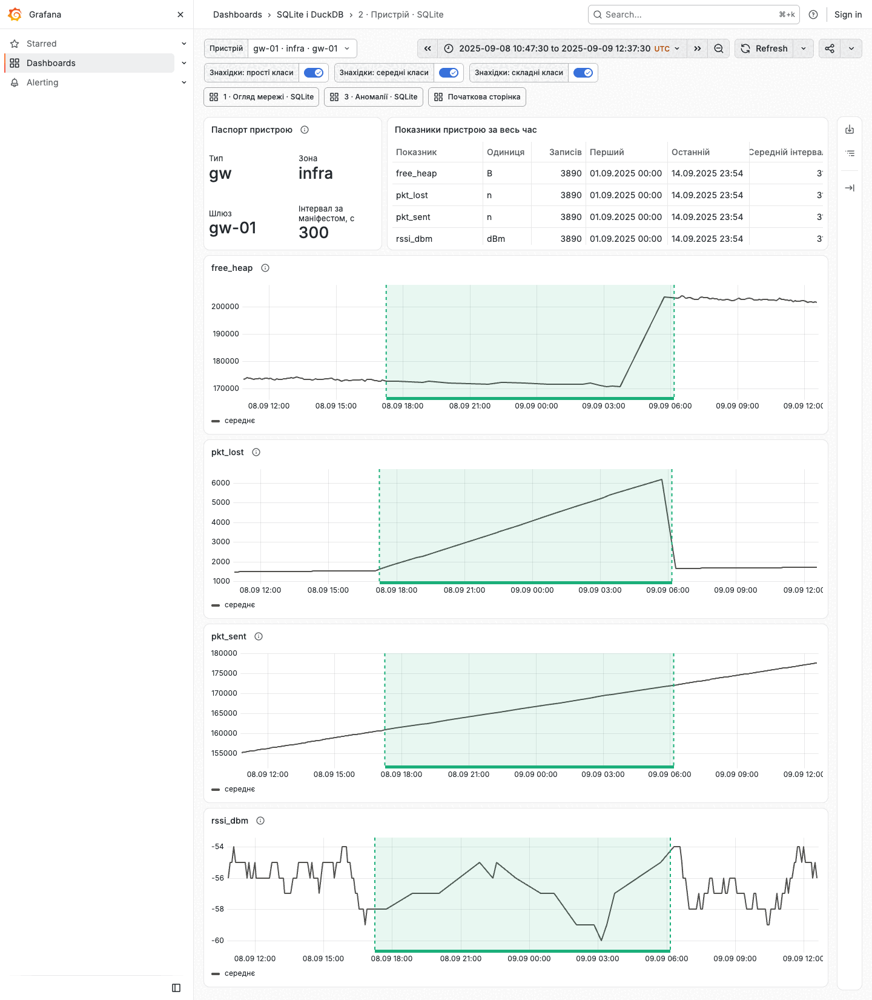

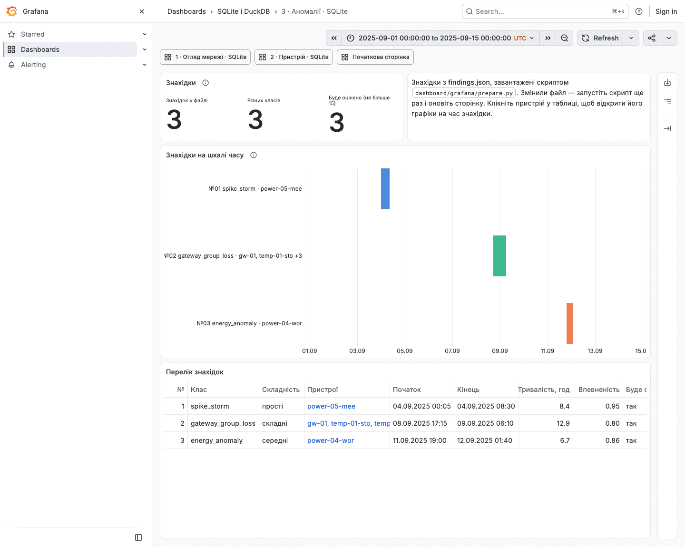

Меню самої Grafana — англійською (української в ній немає), підписи
дашбордів — українською.

### Зупинка і зміни

```bash
docker compose -f dashboard/grafana/docker-compose.yml stop
```

Щоб змінювати дашборди, натисніть **Sign in** угорі праворуч (`admin` /
`kursova2025`), далі **Edit** і **Save dashboard**. Щоб перенести зміни у
свій репозиторій: **Export → Export as JSON → Save to file** і замініть файл
у `dashboard/grafana/dashboards/<ваше сховище>/`.

### Якщо панель червона або порожня

Наведіть курсор на червоний трикутник у кутку панелі, щоб прочитати помилку:

| Помилка | Що зробити |
|---|---|
| `no such table: devices` (SQLite) / `relation "devices" does not exist` (TimescaleDB) | не запущено `prepare.py` — запустіть |
| `lookup influxdb … no such host` (InfluxDB) / `failed to connect to server` (TimescaleDB) | не запущено сервер сховища: `docker compose -f pipeline/docker-compose.yml up -d`, потім **Refresh** |
| `unable to open database file: out of memory (14)` | це **не** про пам'ять: у папці проєкту немає `iot.sqlite` — запустіть `prepare.py` |
| «No data» на всіх панелях | вибраний період не збігається з датами ваших даних |
| `port is already allocated` під час `docker compose up` | порт 3000 зайнятий іншою програмою: закрийте її або змініть у `dashboard/grafana/docker-compose.yml` рядок `"127.0.0.1:3000:3000"` на `"127.0.0.1:3001:3000"` і відкривайте <http://localhost:3001> |

---

## 6.5. Як читати огляд мережі

Пристрої надсилають повідомлення з різною частотою (від кількох на хвилину
до одного на 5 хвилин), тож «скільки повідомлень за годину» між пристроями
не порівняти. Тому карта показує **відсоток від звичайного для цього
пристрою**: сірий — як завжди, червоний — менше або нічого, синій — більше,
ніж зазвичай.

Знахідки розфарбовано за **складністю класу**: синій — прості, помаранчевий —
середні, зелений — складні (ті самі групи, що й у правилах оцінювання).
Назва класу завжди підписана поруч.

**Увага.** Дашборд — це **інструмент огляду**, а не детектор: він показує,
де варто придивитися, але нічого не класифікує й не записує знахідок. Кожну
знахідку ви обґрунтовуєте самі (стадія 5).

---

## 6.6. Зробіть дашборд своїм

На демонстрації вас оцінюють за тим, чи працює дашборд на **ваших** даних і
чи можете ви пояснити кожен його елемент. Тому:

1. Запустіть дашборд на своєму варіанті і своєму `findings.json`.
2. Пройдіть усі три сторінки й переконайтеся, що розумієте, що показує
   кожна панель і як вона рахується (код відкритий — подивіться запити).
3. Перевірте вимогу «придатний для того, хто не є автором»: попросіть
   одногрупника без вашої допомоги знайти на дашборді одну з ваших знахідок
   і відкрити графік відповідного пристрою. Що виявилося незрозумілим —
   виправте (підпис, пояснення, порядок панелей).
4. Підготуйте показ дашборда для захисту: на нього в доповіді є близько
   хвилини (див. крок 8.4), а запитання можуть стосуватися будь-якої панелі.

---

## У звіт

- Знімки всіх трьох сторінок — у додатки.
- У підрозділі 3.3 для кожної знахідки — знімок сторінки пристрою з вікном
  цієї знахідки.
- Одним абзацом: що показує кожна сторінка і чому саме так (наприклад, чому
  на огляді відсоток від звичайного, а не кількість повідомлень).

---

## Контрольний список стадії 6

- [ ] Дашборд призначеного інструмента запускається на вашому варіанті.
- [ ] На сторінці аномалій — ваші знахідки з `findings.json`.
- [ ] Перехід зі знахідки на сторінку пристрою працює.
- [ ] Хтось інший зміг знайти на дашборді вашу знахідку без підказок.
- [ ] Знімки трьох сторінок збережено для записки.

[← Стадія 5](05-poshuk.md) · [Далі: пояснювальна записка →](07-zvit.md)
